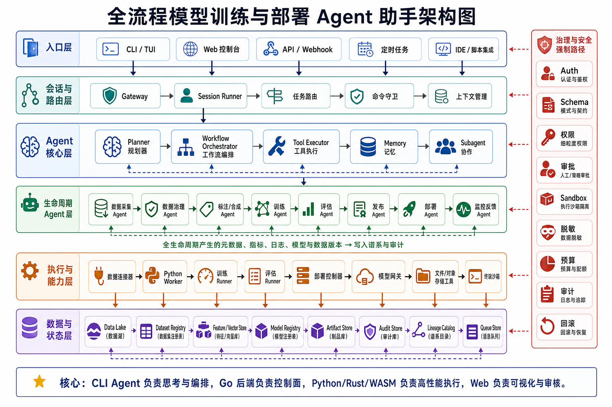
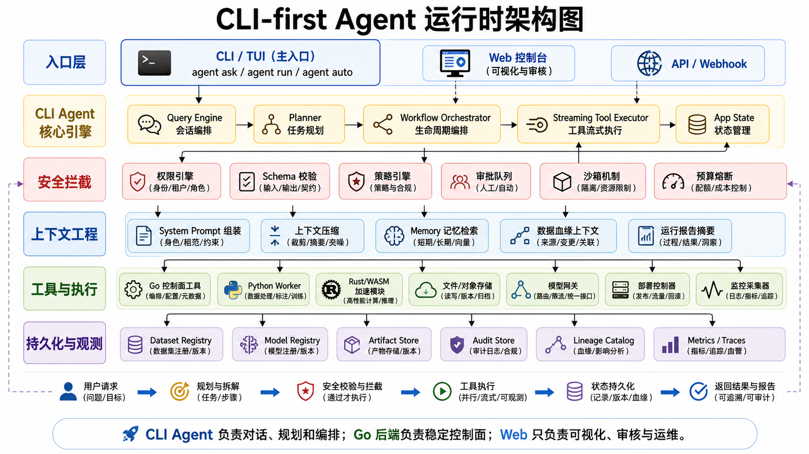
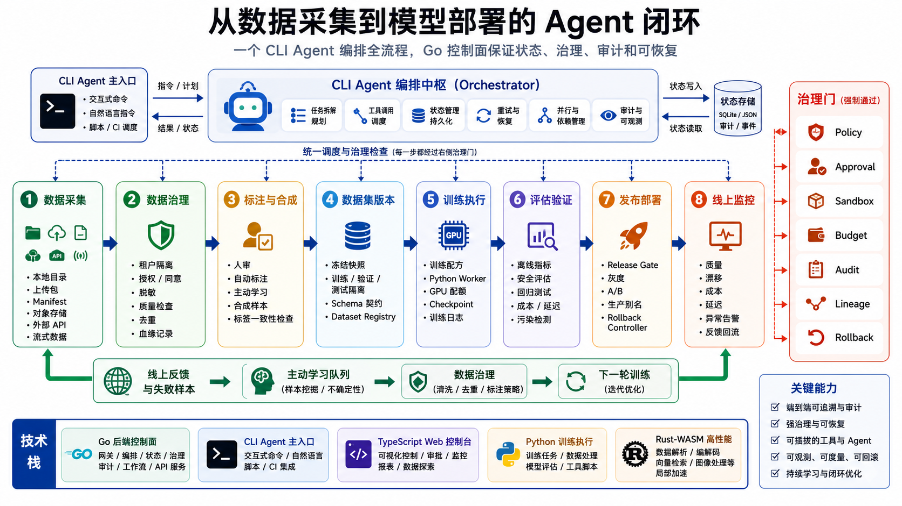

# Automated Training Model

从数据采集到模型部署的 **CLI-first Agent 助手**。项目目标不是只做一个标注页面，而是把数据接入、数据治理、人工复核、自动标注、训练、评估、发布、部署、监控和反馈回流串成一个可审计、可恢复、可扩展的模型工程闭环。



## 核心定位

Automated Training Model 面向“小模型训练到部署”的真实工程流程：

- **核心是 Agent**：CLI 负责对话、规划、执行和自动化，Web 只是控制台和审核面。
- **后端使用 Go**：Go 承接 Gateway、会话、治理、工作流、状态、审计、模型注册和部署控制面。
- **前端使用 TypeScript + React**：用于数据浏览、视频审核、Agent 控制台、运行状态和人工审批。
- **Python 负责模型执行**：训练、评估、自动标注、VLM、tracking、segmentation 等模型生态放在 worker 层。
- **Rust / WASM 只做局部加速**：用于轨迹几何、IoU、视频帧索引、mask/RLE 等确定性高性能计算，不作为主前端框架。

## 架构总览

系统拆成两个核心域：

```text
Agent Serving Platform
  CLI / Web / API / Cron
  Gateway / Session Runner / Planner / Tool Executor
  Governance / Approval / Sandbox / Audit / Memory

Model & Data Training Platform
  Data Collection / Data Governance / Labeling
  Training / Evaluation / Release / Deployment / Monitoring
  Dataset Registry / Model Registry / Artifact Store / Lineage Catalog
```

两者只通过显式契约连接：workflow request、dataset version、model artifact、evaluation report、promotion event、audit event。运行时会话状态不会直接流入训练数据，训练数据必须经过治理、脱敏、去重、质量检查、版本冻结和血缘记录。

更多架构图见：[docs/AGENT_ARCHITECTURE_DIAGRAMS.md](docs/AGENT_ARCHITECTURE_DIAGRAMS.md)。

## 架构图

### 全流程模型训练与部署 Agent 助手架构图


### CLI-first Agent 运行时架构图



### 从数据采集到模型部署的 Agent 闭环



## 当前能力

- 视频、帧、tracking 数据浏览与 Canvas 渲染。
- Tracking 审核、删除预览、源 CSV 硬删除和自动备份。
- 对象级异常事件标注：视频 -> 异常片段 -> 异常事件 -> 相关对象。
- 帧级 anomaly mask 自动切分候选异常片段。
- 数据接入：本地目录、上传 zip、manifest 注册。
- Agent registry、tool registry、workflow registry、run API、audit API。
- 默认全流程工作流：`data-to-deployment-lifecycle`。
- Governance control surface：强制检查点、数据治理、发布治理、运行策略、Schema、预算、租户隔离和恢复策略。
- 模型注册元数据持久化到 `data_lake/models/models.json`，模型权重和 checkpoint 不进入 Git。
- Agent Runtime session/trace 默认持久化到 `data_lake/runtime`，Web/CLI/桌面端/QQ 共用同一份运行态审计记录。
- Agent Runtime model jobs 默认持久化到 `data_lake/runtime/model_jobs.json`；服务重启前未完成的下载任务会恢复为 `interrupted`，重新提交后可利用 HuggingFace cache 继续。
- Tool schema / preflight / runner 已拆到 `internal/app/toolapp`：未注册工具、未知参数、高风险审批缺失和缺失 handler 会在具体执行前被拦截。
- Data Intake Plan 的 dry-run 构造已拆到 `internal/app/intakeapp`：runtime 的 `intake.plan` / `vlm.inspect` handler 只调用 intake app，并把 `plan_id`、`dataset_name`、`source_uri` 和审批边界写入 trace metadata；计划默认持久化到 `data_lake/runtime/intake/intake_plans.json`。
- Python/Mimo runtime 默认使用常驻 `python -m agent_runtime.worker`，`labelctl agent` 会显示 `transport=python-worker`；普通聊天走 fast chat + NDJSON token streaming，复杂任务才进入 JSON planner 和 ToolExecutor。

## Agent 生命周期

默认主工作流覆盖完整模型工程链路：

```text
collect
  -> profile
  -> govern_data
  -> curate
  -> label_or_review
  -> train
  -> evaluate
  -> release
  -> deploy
  -> monitor
  -> report
```

CLI 是主入口：

```powershell
. .\ops\scripts\resolve-go.ps1
$go = Resolve-Go
& $go build -o .\bin\labelctl.exe .\cmd\labelctl
.\bin\labelctl.exe -addr http://127.0.0.1:7870 agent
```

进入交互式 Agent CLI 后，可以像 Claude Code 一样连续输入。当前 CLI 会展示 gateway、session、runtime 入口、模型路由、agent trace、tool IDs 和 doctor 信息：

```text
atm:01 planner-agent> /status
atm:01 planner-agent> /ping
atm:02 planner-agent> 请帮我规划 ShanghaiTech 数据接入
atm:03 planner-agent> /traces
atm:03 planner-agent> /doctor
atm:03 planner-agent> /exit
```

内置命令：

```text
/status      runtime、模型路由、sub-agents 和计数器
/sessions    当前 channel/session 表
/traces      最近 agent/tool trace tree
/jobs        模型下载和后台 job 表
/doctor      gateway、本机 CLI、LLM/Mimo 环境变量诊断
/json <x>    status/sessions/traces/jobs 原始 JSON
/clear       清屏
/ping        走同一 runtime path 发送 /bot-ping
/exit        退出
```

等待 Mimo 或 planner 返回时，CLI 会即时显示 `planner-agent working...` 和耗时，避免终端看起来卡死。普通 fast chat 已接入 `/api/runtime/stream-message`，Mimo 返回 token 后会直接刷到终端；复杂 planner 和工具执行当前仍以状态事件 + 最终结果为主，实时 tool progress streaming 仍在 TODO 中。

也可以使用一次性命令：

```powershell
.\bin\labelctl.exe -addr http://127.0.0.1:7870 agent "请帮我规划 ShanghaiTech 数据接入"
.\bin\labelctl.exe -addr http://127.0.0.1:7870 runtime status
.\bin\labelctl.exe -addr http://127.0.0.1:7870 runtime sessions
.\bin\labelctl.exe -addr http://127.0.0.1:7870 runtime traces
.\bin\labelctl.exe -addr http://127.0.0.1:7870 runtime model-jobs
.\bin\labelctl.exe -addr http://127.0.0.1:7870 channel qq test /bot-ping
.\bin\labelctl.exe -addr http://127.0.0.1:7870 skill draft -id qq-data-intake-demo -summary "QQ 上传图片后进入隔离区、视觉检查、生成 Data Intake Plan"
```

### 四入口 Runtime 闭环

当前 Web、CLI、桌面端和 QQ/NapCat 都进入同一个 Agent Runtime：

| 入口 | 当前能力 | 验证方式 |
| --- | --- | --- |
| Web | Agent Overview 查看 runtime status、sessions、traces、model jobs，并通过 QQ test-message 发送测试消息 | 打开 `http://127.0.0.1:7870/` |
| CLI | 查询 runtime、发送测试消息、查看异步模型任务 | `labelctl runtime status/sessions/traces/model-jobs/send` |
| 桌面端 | 复用 Gateway runtime snapshot | `go run .\cmd\agentdesktop -addr http://127.0.0.1:7870` |
| QQ/NapCat | OneBot webhook/test-message 进入 runtime，可配置 outbound 回发 | `/api/channels/qq/onebot`、`/api/channels/qq/test-message` |

更完整的本机 smoke：

```powershell
powershell -NoProfile -ExecutionPolicy Bypass -File .\ops\scripts\smoke-runtime-mvp.ps1
powershell -NoProfile -ExecutionPolicy Bypass -File .\ops\scripts\smoke-runtime-mvp.ps1 -UseMimoPlanner
powershell -NoProfile -ExecutionPolicy Bypass -File .\ops\scripts\runtime-hf-install.ps1
powershell -NoProfile -ExecutionPolicy Bypass -File .\ops\scripts\smoke-locateanything-model.ps1
```

该脚本会验证：runtime status、CLI send、QQ test-message、OneBot reply envelope、桌面端状态、model-jobs API、普通文本进入 `planner-agent`、图片附件进入 `vision-agent` 并产生 `vlm.inspect` trace、ShanghaiTech 数据附件进入 `data-intake-agent` 并产生 `intake.plan` trace metadata；随后重启 labelserver，确认 session/trace 能从 JSON RuntimeStore 恢复。

`runtime-hf-install.ps1` 默认只做 Mimo -> Agent Runtime -> `model.download_hf` 预检，并通过审批边界停在 `approval_required`，不会下载权重；只有显式传入 `-StartDownload -WaitForCompletion` 才会开始真实 7GB 级模型下载。当前本机已通过 Agent Runtime 下载并 verify-only 校验 `nvidia/LocateAnything-3B`，本地路径为 `data_lake/models/artifacts/huggingface/nvidia/LocateAnything-3B`，该目录在 `data_lake/` 下，不进入 Git。

`smoke-locateanything-model.ps1` 会通过 Runtime 执行 `model.verify_hf`、`model.smoke_locateanything` 和 `workflow.submit_run(dry_run=true)`。当前本机已完成 LocateAnything-3B 加载 smoke：`AutoConfig`、`AutoProcessor`、safetensors shard 和 `AutoModel.from_pretrained` 均通过；由于当前 PyTorch 是 CPU-only，真实 ShanghaiTech 推理仍未标记完成。

### 什么时候使用 Sub-Agent

| 场景 | 默认处理 |
| --- | --- |
| `/bot-ping`、`/bot-me`、`/bot-status`、`/bot-runs`、`/bot-run dry` | Go control plane 直接处理，不使用 sub-agent |
| 普通自然语言请求 | `planner-agent`，负责意图细化和 tool-call plan |
| QQ/Web 上传图片、截图、异常帧 | `vision-agent`，走 Mimo `mimo-v2.5` 视觉路由 |
| QQ/Web 上传 zip、manifest、目录索引或数据附件 | `data-intake-agent`，通过 ToolExecutor 生成 dry-run Data Intake Plan，trace metadata 记录 `plan_id`、`dataset_name`、`source_uri` 和审批边界 |
| 训练、评估、部署等长流程 | `training-agent` / 后续 release agent，只规划并通过 ToolExecutor/Workflow 执行 |
| 成功 trace 总结可复用 skill | `skill-miner-agent`，默认关闭，只生成草稿，人工审批后启用 |

Sub-agent 不能绕过 ToolExecutor、approval/preflight、data_lake 写入边界和审计。

如果要让本机登录的 QQ 通过 NapCat 主动收到回复，先设置：

```powershell
. .\ops\scripts\set-qq-napcat-env.example.ps1
```

一键 smoke test：

```powershell
.\ops\scripts\smoke-agent-entrypoints.ps1
```

如需 LLM 规划能力，配置 OpenAI-compatible endpoint：

```powershell
$env:LLM_BASE_URL="http://127.0.0.1:11434/v1"
$env:LLM_MODEL="qwen2.5"
$env:LLM_API_KEY=""

go run .\cmd\labelctl agent "注册一个本地数据集并创建从数据采集到部署的 dry-run 工作流"
```

Mimo 本机配置从 `C:\Users\10495\Desktop\mimo.txt` 读取并写入服务端环境变量，不要写入 Git、浏览器端或 channel 消息：

```powershell
. .\ops\scripts\load-mimo-env.ps1
powershell -NoProfile -ExecutionPolicy Bypass -File .\ops\scripts\smoke-mimo-api.ps1
powershell -NoProfile -ExecutionPolicy Bypass -File .\ops\scripts\smoke-mimo-planner.ps1
```

文本规划默认使用 `mimo-v2.5-pro`，视觉理解默认使用 `mimo-v2.5`。普通聊天默认走 fast chat，`AGENT_RUNTIME_FAST_CHAT=false` 可关闭；`AGENT_RUNTIME_PYTHON_WORKER=false` 可把 Python planner 从常驻 worker 回退到单次 spawn 模式。

模型下载是 runtime 异步长任务。`model.download_hf` 会立即返回 `queued/job_id`，后台任务写入 `data_lake/models/artifacts/huggingface`，任务状态持久化到 `data_lake/runtime/model_jobs.json` 并可从 `runtime model-jobs` 查询。模型权重、checkpoint、HF cache 和真实 API Key 不能提交到 Git。

默认本机开发模式允许高风险工具进入受控执行；需要统一收紧时设置：

```powershell
$env:AGENT_RUNTIME_REQUIRE_HIGH_RISK_TOOL_APPROVAL="true"
```

模型下载还保留专用审批开关：

```powershell
$env:AGENT_RUNTIME_REQUIRE_MODEL_DOWNLOAD_APPROVAL="true"
```

## 技术栈

| 层 | 技术 | 责任 |
| --- | --- | --- |
| CLI | Go | Agent 主入口、工作流提交、治理查询、LLM 规划 |
| Backend | Go / DDD / Hexagonal | 控制面、API、注册表、审计、队列边界、模型注册 |
| Frontend | React / TypeScript / Vite | 数据审核、Agent 控制台、运行与治理可视化 |
| Acceleration | Rust / WASM | 热路径几何与轨迹计算 |
| Workers | Python | 模型推理、训练、评估、报告生成 |
| Storage | JSON MVP -> PostgreSQL / MinIO / Redis / NATS | 元数据、产物、任务状态、队列和血缘 |

## 项目结构

```text
cmd/                      Go 可执行程序入口
internal/api/             HTTP/API 适配层
internal/app/             应用服务与端口接口
internal/cli/             CLI Agent 命令与规划逻辑
internal/domain/          领域模型
internal/infrastructure/  存储、队列、模型网关、中间件实现
internal/trigger/         服务启动与外部触发器
web/                      Vite + React + TypeScript 前端工程
workers/python/           Python worker 契约与执行入口
skills/                   Agent skills
docs/                     产品、SDD、架构和维护文档
ops/                      部署、脚本、配置、迁移和工具
```

## 本机运行

先启用 PowerShell UTF-8 模式，避免中文文档、脚本输出和 Python/Go 输出在 Windows PowerShell 里乱码：

```powershell
cd F:\automated_training_model
. .\ops\scripts\utf8.ps1
.\ops\scripts\encoding-doctor.ps1
```

构建前端：

```powershell
cd F:\automated_training_model\web
npm install
npm run build
```

启动 Go 服务：

```powershell
cd F:\automated_training_model
. .\ops\scripts\resolve-go.ps1
$go = Resolve-Go
& $go run .\cmd\labelserver `
  -addr 127.0.0.1:7870 `
  -merge-root F:\keyan\token_compression\data\shanghai\new_tracking\merge `
  -frame-root F:\keyan\token_compression\data\shanghai\data\testing\frames `
  -mask-root F:\keyan\token_compression\data\shanghai\data\testframemask `
  -annotation-root F:\keyan\token_compression\data\shanghai\new_tracking\merge\annotations_review `
  -web-root F:\automated_training_model\web `
  -data-root F:\automated_training_model\data_lake `
  -model-root F:\automated_training_model\data_lake\models `
  -agent-root F:\automated_training_model\data_lake\agents `
  -runtime-root F:\automated_training_model\data_lake\runtime
```

如果要让 `labelctl agent` 像 Claude Code 一样通过 Mimo planner 工作，先在启动 `labelserver` 的同一个 PowerShell 会话里加载 Mimo 环境：

```powershell
cd F:\automated_training_model
. .\ops\scripts\utf8.ps1
. .\ops\scripts\resolve-go.ps1
. .\ops\scripts\load-mimo-env.ps1
$go = Resolve-Go
& $go run .\cmd\labelserver `
  -addr 127.0.0.1:7870 `
  -merge-root F:\automated_training_model\tmp\smoke-media\merge `
  -frame-root F:\automated_training_model\tmp\smoke-media\frames `
  -mask-root F:\automated_training_model\tmp\smoke-media\masks `
  -annotation-root F:\automated_training_model\tmp\smoke-media\annotations_review `
  -web-root F:\automated_training_model\web `
  -data-root F:\automated_training_model\data_lake `
  -model-root F:\automated_training_model\data_lake\models `
  -agent-root F:\automated_training_model\data_lake\agents `
  -runtime-root F:\automated_training_model\data_lake\runtime
```

`load-mimo-env.ps1` 会读取 `C:\Users\10495\Desktop\mimo.txt`，并自动设置 `AGENT_RUNTIME_PLANNER=python`、`AGENT_RUNTIME_USE_MIMO=true`、`AGENT_RUNTIME_PYTHONPATH=...\workers\python`。进入 CLI 后用 `/status` 或 `/doctor` 检查服务端是否显示 `planner=python mimo=true token=true`。

打开：

```text
http://127.0.0.1:7870/
```

前端开发：

```powershell
cd F:\automated_training_model\web
npm run dev
```

Vite 会把 `/api` 代理到 `http://127.0.0.1:7870`。

## 文档入口

- [SDD 文档索引](docs/SDD_INDEX.md)
- [统一 SDD 总纲](docs/SYSTEM_DESIGN_DOCUMENT.md)
- [Agent 架构图](docs/AGENT_ARCHITECTURE_DIAGRAMS.md)
- [Agent 系统设计](docs/AGENT_SYSTEM_DESIGN.md)
- [Agent Runtime 设计](docs/AGENT_RUNTIME_SDD.md)
- [Agent Runtime MVP SDD](docs/AGENT_RUNTIME_MVP_SDD.md)
- [Agent Runtime MVP ATDD](docs/AGENT_RUNTIME_MVP_ATDD.md)
- [Agent Runtime MVP TDD](docs/AGENT_RUNTIME_MVP_TDD.md)
- [Sub-Agent 使用策略](docs/SUB_AGENT_STRATEGY_SDD.md)
- [Intent / Tool / Skill / MCP 设计](docs/INTENT_TOOL_SKILL_MCP_SDD.md)
- [图片生成代理与 Skill 自进化](docs/IMAGE_PROXY_AND_SKILL_EVOLUTION_SDD.md)
- [入口测试 SDD](docs/ENTRYPOINTS_TEST_SDD.md)
- [代码架构](docs/CODE_ARCHITECTURE.md)
- [三端界面设计](docs/INTERFACE_DESIGN.md)
- [远程连接策略](docs/REMOTE_CONNECTION_SDD.md)
- [Channel 数据接入](docs/CHANNEL_DATA_INGEST_SDD.md)
- [前端架构](docs/FRONTEND_ARCHITECTURE.md)
- [WASM 加速层](docs/WASM_ACCELERATION.md)
- [LLM Provider 设置](docs/LLM_PROVIDER_SETUP.md)
- [当前待办](docs/PROJECT_TODO.md)
- [完成记录](docs/PROJECT_DONE.md)

## 当前阶段

这是一个正在演进中的工程平台。当前已经完成控制面骨架、Agent/Tool/Workflow 注册表、治理模型、Web 控制台、视频审核基础能力、Agent Runtime session/trace JSON 持久化、model job JSON 持久化、intake plan JSON 持久化、tool schema/preflight/runner 边界、intake dry-run planner 外迁、Mimo fast chat、常驻 Python planner worker 和 CLI fast chat token streaming；下一阶段重点是 tool progress streaming、durable queue、`model.*`/`workflow.*` handler 外迁、model job 进度日志/取消/自动 resume、真实 Python model worker runner、artifact manifest、lineage catalog、run log stream 和更严格的策略执行。
