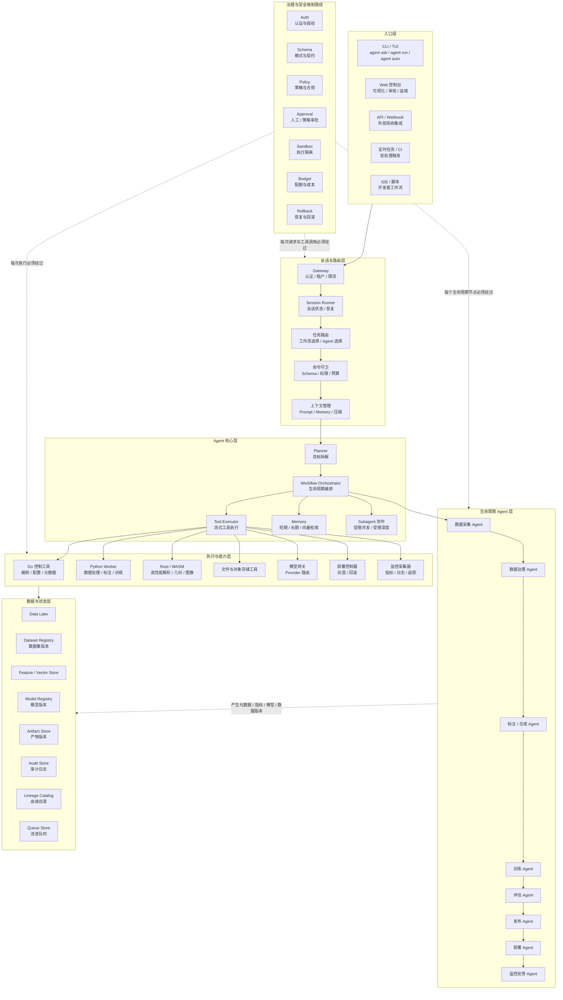
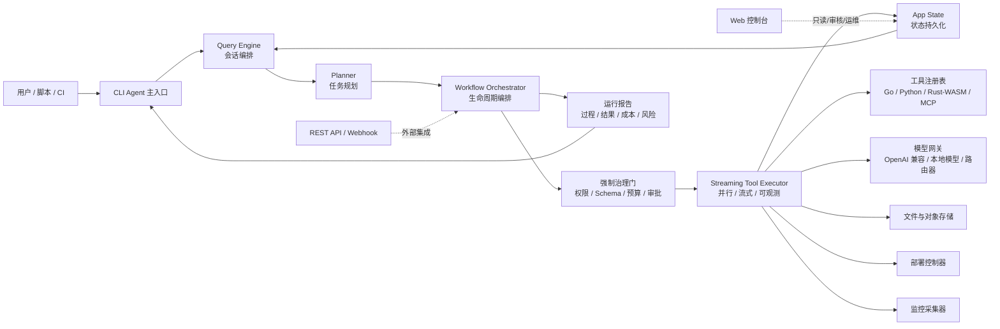
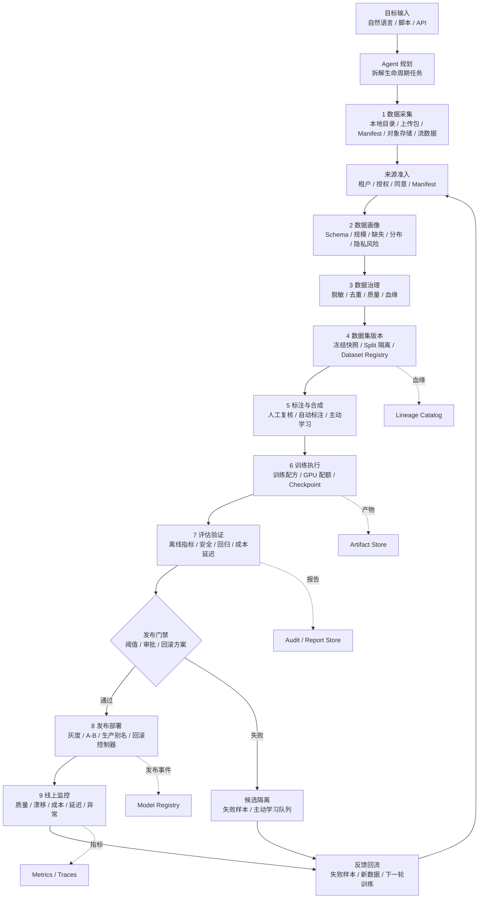

# Agent 架构图

这些图替换之前的两张 PNG。架构以 Mermaid 作为可维护源文件，imagegen PNG 作为视觉版参考。当前目标不是做一个页面功能，而是设计一个 **从数据采集到模型部署的 CLI-first Agent 助手**：CLI 是主入口，Go 后端是稳定控制面，Web 控制台只负责可视化、审核和运维。

## 0. Imagegen 视觉版

## 1. 总体分层架构

## 2. CLI-first 运行时架构

设计取舍：

- CLI 是主交互面，负责对话、规划、运行和自动化。
- Go 后端是控制面，负责 Gateway、治理、状态、工作流、审计和部署元数据。
- Web 使用 TypeScript + React，定位为控制台和人工审核界面，不重写主 Agent 对话面。
- Rust / WASM 只放到性能敏感模块，例如几何计算、轨迹解析、视频帧索引和大文件解析。
- Python Worker 承接训练、评估、模型推理和数据处理生态。

## 3. 数据到部署闭环

## 4. 强制治理路径

```mermaid
flowchart LR
  request["用户请求"] --> ingress["入口检查<br/>认证 / 租户 / Schema / 预算"]
  ingress --> planner["任务规划"]
  planner --> toolguard["工具预检<br/>allowlist / 参数 / 权限"]
  toolguard --> modelguard["模型预检<br/>脱敏 / 能力 / 成本 / 保留策略"]
  modelguard --> execguard["执行预检<br/>沙箱 / 文件 / 网络 / 资源"]
  execguard --> worker["隔离执行<br/>Go 工具 / Python Worker / WASM"]
  worker --> egress["结果出站检查<br/>隐私 / 安全 / 审计"]
  egress --> response["结果 / 产物 / 报告"]

  subgraph controls["不可绕过控制面"]
    auth["Auth / Tenant"]
    schema["Schema Registry"]
    policy["Policy Registry"]
    approval["Approval Queue"]
    budget["Budget / Quota"]
    audit["Audit / Trace"]
    recovery["Recovery / Rollback"]
  end

  controls -.强制注入.-> ingress
  controls -.强制注入.-> toolguard
  controls -.强制注入.-> modelguard
  controls -.强制注入.-> execguard
  controls -.强制注入.-> egress
```

## 5. 参考源码吸收的原则

- `E:\agent\cc`：保留 CLI-first、QueryEngine、工具权限提示、会话恢复和流式工具执行的运行时模式。
- `E:\agent\Hermes`：吸收 Gateway、Session Store、插件/技能、记忆提供者和多平台入口的分层方式。
- `E:\agent\openclaw`：吸收统一 Gateway、插件化能力、MCP/工具边界、沙箱与安全默认值。

落到本项目后，核心不是复制通用聊天 Agent，而是把这些模式收敛到模型工程生命周期：采集、治理、标注、训练、评估、发布、部署、监控和反馈回流。
