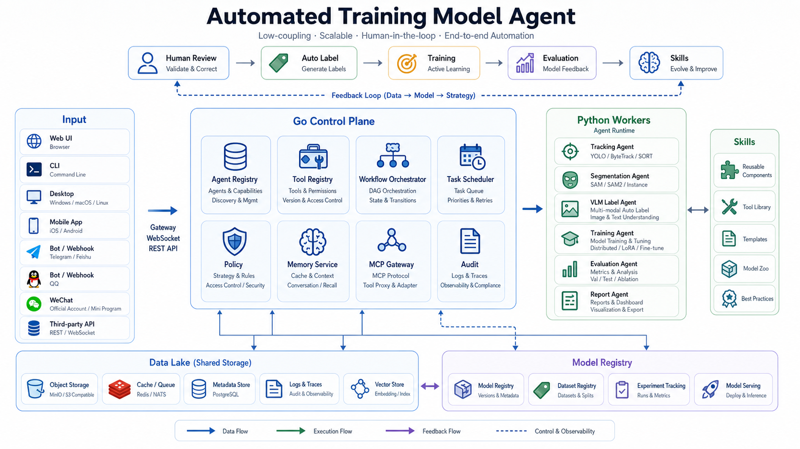

# Automated Training Model Agent 系统设计

## 目标

这个系统要把现有视频标注台扩展为可迭代的训练闭环：人审、自动标注、主动学习、模型训练、评估反馈、Skill 沉淀。核心原则是低耦合：Go 只做控制面和状态管理，Python 只做 GPU/模型执行，前端只做操作台和可观测性。

## 参考项目结论

- `E:\agent\cc`：工具执行按可并发和不可并发分批，适合我们后续把只读数据扫描、指标汇总并行化，把写数据/训练任务串行化。
- `E:\agent\Hermes`：工具、平台、Skill 采用自注册 registry，控制面不硬编码所有执行器。这一模式适合我们的 Agent Registry、Tool Registry、Workflow Registry。
- `E:\agent\openclaw`：Gateway、agent、session、plugin SDK 分离，外部入口通过 RPC/事件访问控制面。我们借鉴其 Gateway 边界，但后端技术栈固定为 Go。

## 技术选择

- 后端：Go。负责 HTTP API、注册表、工作流编排、策略、审计、任务队列、数据湖/模型仓库元数据。
- 前端：React + TypeScript。负责视频审核工作台、Agent 控制台、任务状态、数据/模型可观测性。
- 执行层：Python。负责 YOLO/BoT-SORT、SAM/SAM2、LocateAnything、训练、评估等模型相关工作。
- Agent 协议：先用 JSON job envelope，后续可替换为 NATS、gRPC、Docker/Kubernetes Job，不改变 domain 层。
- 存储：当前 MVP 用 JSON 文件落地到 `data_lake/agents` 和 `data_lake/models`；后续升级为 PostgreSQL/MinIO/Redis/NATS。

## 分层架构

1. 输入层：Web UI、CLI、Bot/Webhook、第三方 API。
2. Go Control Plane：Agent Registry、Tool Registry、Workflow Orchestrator、Task Scheduler、Policy、Audit、MCP/Gateway 适配。
3. Python Workers：Tracking、Segmentation、VLM Label、Training、Evaluation、Report。
4. Data Lake：原始数据、派生标签、训练输入、训练输出、报告。
5. Model Registry：原始模型、训练中 checkpoints、最终模型版本、评估指标。

## 当前已搭建的 MVP

- 新增 `internal/domain/agent`：Agent、Tool、Workflow、Run、Audit 的领域模型。
- 新增 `internal/app/agentapp`：控制面服务，只有 Repository 和 ModelGateway 端口依赖。
- 新增 `internal/infrastructure/agentrepo`：JSON repository，自动 bootstrap 默认 agents/tools/workflows。
- 新增 API：
  - `GET /api/agents`
  - `POST /api/agents`
  - `GET /api/agents/{id}`
  - `GET /api/tools`
  - `POST /api/tools`
  - `GET /api/workflows`
  - `POST /api/workflows`
  - `GET /api/workflows/{id}`
  - `GET /api/agent-runs`
  - `POST /api/agent-runs`
  - `GET /api/audit-events`
- 新增前端 Agent 控制台：展示 agent/tool/workflow 数量、默认工作流、运行记录、审计事件，并可提交 dry-run 工作流。
- 新增 Python worker 边界：`workers/python/agent_worker` 接受 JSON job envelope 并返回 JSON result。
- 新增数据湖 skill：`skills/automated-training-data-lake`，用于后续复制原始数据和下载 Hugging Face 模型。

## 默认 Agent 与工作流

默认注册六类 agent：

- `tracking-agent`：检测和多目标跟踪。
- `segmentation-agent`：交互式分割和 mask 传播。
- `vlm-label-agent`：VLM/grounding 自动标注。
- `training-agent`：训练和 checkpoint 产出。
- `evaluation-agent`：模型评估与指标汇总。
- `report-agent`：报告与 dashboard 输出。

默认工作流：

- `human-loop-autolabel`：tracking -> VLM label -> human review -> train -> evaluate -> report。
- `dataset-to-tracking`：只跑 tracking，用于生成待审派生标签。

## 解耦约束

- Domain 不导入 HTTP、文件系统、Python、React。
- App 层只依赖端口接口，不关心 JSON、数据库或队列实现。
- Infrastructure 层负责 JSON 文件、未来数据库、队列、worker runner。
- API 层只做 JSON 编解码和错误映射。
- Python worker 不读 Go 内部结构，只读稳定 JSON envelope。
- 前端不拼装执行逻辑，只调用 API 并展示状态。

## 后续演进

1. 把内存任务队列替换为 Redis/NATS，并增加 worker ack、retry、heartbeat。
2. 给 Python worker 增加 tool adapter：YOLO/BoT-SORT、SAM2、LocateAnything、训练 runner。
3. 给 `data_lake/catalog` 加 artifact manifest，记录输入数据、输出标签、模型版本和指标之间的 lineage。
4. 把 JSON repository 迁移到 PostgreSQL，同时保留本地开发 JSON adapter。
5. 增加策略系统：GPU 权限、模型下载权限、数据写权限、远程入口权限。
6. 前端增加 workflow DAG、run log stream、模型/数据 lineage 视图。
