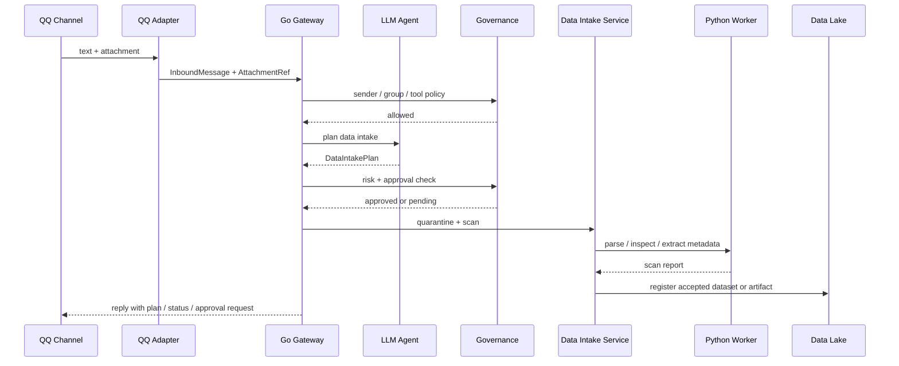

# Channel 数据接入 SDD

版本：v0.1  
日期：2026-06-02  
范围：通过 QQ 等 Channel 向系统传输数据，并由 LLM 驱动的 Agent 完成理解、规划、入湖和工作流触发。当前实现优先 QQ，后续 Telegram、飞书复用同一套 Channel Data Contract。

## 1. 目标

Channel 不只是命令入口，也可以成为数据入口。例如：

- 在 QQ 私聊发送一张异常画面截图，让 Agent 识别内容并创建标注任务。
- 在 QQ 群里上传一个 zip 数据包，让 Agent 判断是否可以入湖。
- 发送 manifest / CSV / JSON 文件，让 Agent 生成数据集注册计划。
- 发送文字说明和文件组合，让 Agent 建立数据集、训练任务或评估任务。

所有这些都由 Agent 规划，但不允许模型直接写 Data Lake 或直接执行训练。执行链路必须经过治理、扫描、审批和审计。

```text
QQ message / attachment
  -> Channel Adapter
  -> InboundMessage + AttachmentRef
  -> Agent Planner
  -> Data Intake Plan
  -> Governance / Approval
  -> Quarantine
  -> Data Lake / Dataset Registry
  -> Workflow Run
```

## 2. 设计原则

1. **Channel 只负责接收和归一化。**  
   QQ Adapter 下载或引用附件，但不直接决定它是不是训练数据。

2. **LLM 负责理解和规划。**  
   Agent 读取消息文本、附件 metadata、必要时调用视觉模型，生成结构化 Data Intake Plan。

3. **Go 负责控制面。**  
   Go Gateway 负责权限、策略、入湖状态、审批、审计、workflow 提交。

4. **Python worker 负责重型处理。**  
   解压、抽帧、VLM 批处理、特征提取、格式转换、质量检查交给 worker。

5. **所有外部数据先进入隔离区。**  
   Channel 上传的数据先放 quarantine，不直接进入正式 Data Lake。

6. **模型可本地或远程。**  
   LLM/VLM 可以是本地部署，也可以是 API provider。当前测试 provider 使用 Mimo 兼容接口，但真实 key 不能进入仓库。

## 3. 数据类型

MVP 支持：

| 类型 | 来源示例 | 初始处理 |
| --- | --- | --- |
| text | QQ 消息文本 | 作为 Agent prompt 和数据说明。 |
| image | 截图、异常帧、样例图 | 生成 AttachmentRef，必要时调用 VLM。 |
| archive | zip / tar | 进入 quarantine，扫描后创建 ingest plan。 |
| manifest | json / jsonl / csv / parquet 索引 | 解析 schema，生成 dataset register plan。 |
| document | md / txt / pdf | 作为说明文档或标注规范，不直接进训练集。 |

## 4. 领域边界

Channel 数据接入拆成三个边界：

```text
channel domain
  InboundMessage / ChannelAttachment / ChannelAccount

intake app
  quarantine / scan / data intake plan / accept / reject

agent app
  LLM planning / tool policy / workflow run request
```

禁止反向依赖：

- `qqbot` 不能 import `datasetrepo` 直接写数据集。
- `qqbot` 不能 import `workflowapp` 直接提交训练。
- `intakeapp` 不能依赖 QQ 专有字段。
- Agent 输出不能直接变成 shell 命令，必须先成为结构化 plan。

## 5. LLM / VLM Provider 策略

Provider 不能写死在业务代码里。Agent Planner 通过 capability 选择模型：

| 能力 | 用途 | 测试模型 |
| --- | --- | --- |
| text planning | 意图识别、计划生成、风险判断 | `mimo-v2.5-pro` |
| vision | 图片理解、截图描述、异常候选解释 | `mimo-v2.5` |
| json schema | 输出 DataIntakePlan | `mimo-v2.5-pro` |

本地测试可使用 Mimo 兼容接口，但 key 只能设置在本机环境变量或 secret store：

```powershell
$env:LLM_BASE_URL="https://token-plan-cn.xiaomimimo.com/v1"
$env:LLM_MODEL="mimo-v2.5-pro"
$env:LLM_API_KEY="<local-secret>"

$env:VLM_BASE_URL="https://token-plan-cn.xiaomimimo.com/v1"
$env:VLM_MODEL="mimo-v2.5"
$env:VLM_API_KEY="<local-secret>"
```

如果使用 Anthropic-compatible 工具链，可在本机 shell 设置：

```powershell
$env:ANTHROPIC_BASE_URL="https://token-plan-cn.xiaomimimo.com/anthropic"
$env:ANTHROPIC_AUTH_TOKEN="<local-secret>"
$env:ANTHROPIC_MODEL="mimo-v2.5-pro"
$env:ANTHROPIC_DEFAULT_SONNET_MODEL="mimo-v2.5-pro"
$env:ANTHROPIC_DEFAULT_OPUS_MODEL="mimo-v2.5-pro"
$env:ANTHROPIC_DEFAULT_HAIKU_MODEL="mimo-v2.5-pro"
```

注意：若 provider 套餐只允许交互式编程/智能体工具使用，则该 key 只能用于本地交互式测试，不能放入自动化后端、公开服务或浏览器端。生产环境需要换成许可范围匹配的 provider key。

## 6. 入站流程



## 7. 示例

### 7.1 QQ 发送图片

用户：

```text
@Agent 这张图里是不是有异常？如果有，帮我建一个审核任务。
```

Agent 计划：

```json
{
  "intent": "create_review_task",
  "risk_level": "low",
  "dry_run": true,
  "proposed_actions": [
    { "kind": "quarantine", "params": { "attachment_id": "att_001" } },
    { "kind": "vision_inspect", "params": { "model_capability": "vision" } },
    { "kind": "submit_workflow", "params": { "workflow_id": "human-loop-autolabel" } }
  ]
}
```

### 7.2 QQ 上传 zip 数据集

用户：

```text
@Agent 这是今天采集的新数据，帮我检查格式，如果没问题注册成数据集。
```

Agent 计划：

```json
{
  "intent": "register_dataset",
  "risk_level": "medium",
  "dry_run": true,
  "proposed_actions": [
    { "kind": "quarantine", "params": { "attachment_id": "att_zip" } },
    { "kind": "scan_archive", "params": { "max_size_mb": "2048" } },
    { "kind": "infer_dataset_schema", "params": {} },
    { "kind": "register_dataset_dry_run", "params": {} }
  ],
  "required_approvals": ["dataset.register"]
}
```

## 8. 安全策略

- 不信任任何 Channel 上传数据。
- 文件名不能决定存储路径，必须重新分配 storage key。
- 禁止 zip slip / 路径穿越。
- 设置单文件大小、总大小、文件数量限制。
- 附件必须 hash，重复文件去重。
- VLM 读取的是隔离文件引用，不是任意本机路径。
- Agent 输出必须是结构化 plan，不能直接拼 shell 命令执行。
- 所有入湖动作写 lineage 和 audit。
- QQ 群上传数据默认只能 dry-run，正式入湖需要审批。

## 9. SDD 测试

| ID | 场景 | 验收标准 |
| --- | --- | --- |
| CDI-001 | QQ 发送纯文本任务 | Agent 返回结构化计划，不创建数据文件。 |
| CDI-002 | QQ 发送图片 | 图片进入 quarantine，VLM 生成说明，audit 记录 attachment id。 |
| CDI-003 | QQ 发送 zip | zip 不直接入湖，先生成 scan report 和 dry-run register plan。 |
| CDI-004 | 未授权 sender 上传文件 | 文件不下载或立即 rejected，audit 记录 denied。 |
| CDI-005 | zip 包含 `../` 路径 | scan rejected，不写入 accepted。 |
| CDI-006 | 群聊未 @Bot 上传文件 | 不触发 Agent，不创建 intake plan。 |
| CDI-007 | Agent 计划正式注册数据集 | 进入 approval，未审批前不写 Dataset Registry。 |
| CDI-008 | 使用 Mimo vision 测试图片 | provider key 只来自环境变量，日志不出现 key。 |
| CDI-009 | Provider 不支持 vision | Agent 返回需要视觉模型的 follow-up，不误用 text-only model。 |
| CDI-010 | 同一附件重复上传 | hash 去重，保留多个 source event。 |

## 10. 实施顺序

当前 MVP 实现状态：

- `internal/app/intakeapp` 已实现 `PrepareWorkflowFromMessage`，覆盖附件 quarantine、静态 metadata scan、dry-run Data Intake Plan、pending approval workflow、approve 和 register metadata。
- `internal/infrastructure/intakerepo.JSONRepository` 默认持久化 `intake_plans.json`、`intake_attachments.json` 和 `intake_workflows.json`。
- Gateway 已提供 `GET /api/runtime/intake/workflows`、`GET /api/runtime/intake/workflows/{id}`、`POST /approve`、`POST /register`；CLI 已提供 `labelctl runtime intake`、`approve-intake`、`register-intake`。
- 当前 scan 仍是 metadata 静态扫描，不展开压缩包、不做真实文件隔离复制、不写正式 Dataset Registry。

1. 在 Channel domain 增加 `ChannelAttachment` 和 `DataIntakePlan`。
2. 增加 `internal/app/intakeapp`，负责 quarantine、scan、plan、accept/reject。
3. QQ Adapter 支持附件 metadata 和受控下载。
4. Agent Planner 输出 JSON DataIntakePlan。
5. 接入 Mimo OpenAI-compatible provider 做本地交互式测试。
6. 增加 SDD 测试中的安全、权限、VLM 和入湖 dry-run 测试。
