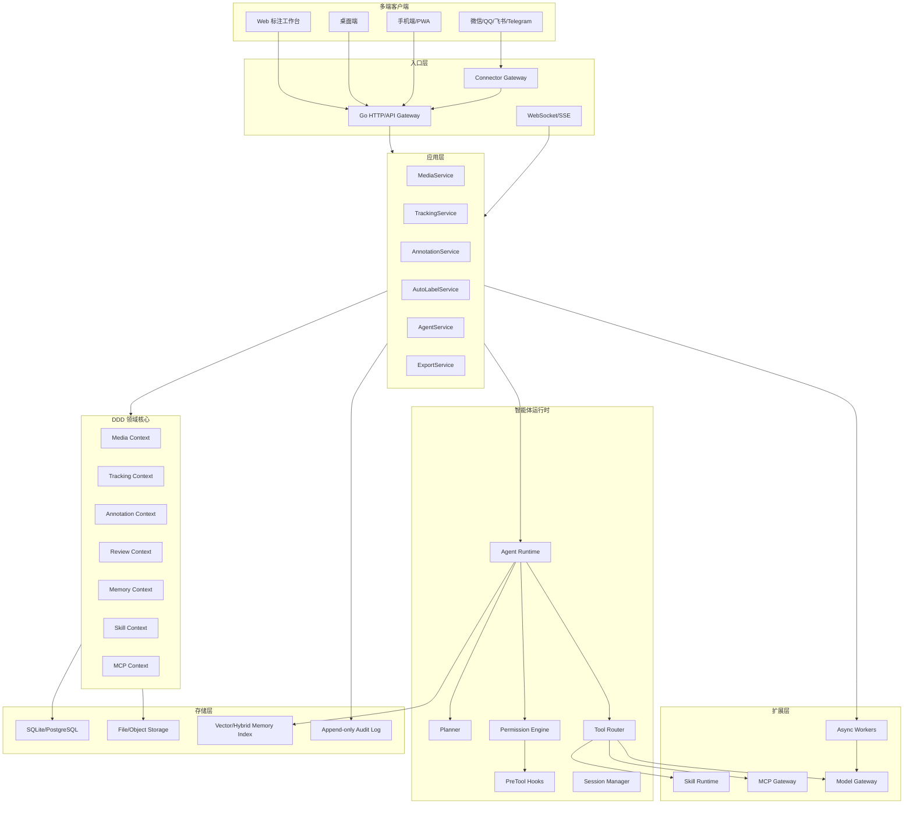

# Go 主后端的视频标注智能体平台架构设计

版本：v0.1  
日期：2026-05-31  
主后端：Go  
参考项目：OpenClaw、Hermes Agent、Claude Code / Claude Agent SDK

## 1. 参考项目结论

### 1.1 从 OpenClaw 借鉴什么

OpenClaw 的关键价值不是某个 UI，而是它把 agent 系统拆成了稳定的几层：

- Model Layer：模型只是依赖，不是系统本身。
- Memory Layer：短期上下文和长期持久记忆。
- Tool Layer：内置工具与可安装技能。
- Channel Layer：Slack、Discord、Web、API 等用户入口。

OpenClaw 的最小数据流也很适合作为本平台多端入口的参考：

```text
Message arrives
  -> Gateway normalizes it and chooses a session key
  -> Agent runs tool/model turn
  -> Output streams back to the originating channel
```

对我们的启发：

- 微信、QQ、飞书、Telegram 都只是 Channel，不应直接进入标注领域核心。
- 必须有一个长驻 Gateway 层统一做消息标准化、权限、session routing。
- 模型应隐藏在 Provider / ModelGateway 后面。
- 状态要清楚拆成 config、workspace、sessions、logs、memory。

### 1.2 从 Hermes 借鉴什么

Hermes 的关键价值是：

- 自进化闭环：从经验中生成技能，使用中改进技能。
- 多平台入口：CLI 和消息 Gateway 共用会话能力。
- Skill 系统：把可复用流程封装成可安装能力。
- Memory：跨会话搜索、用户建模、持久化知识。
- Cron / scheduled automation：长期后台任务。
- 子代理与并行任务：复杂任务拆给隔离 worker。
- 插件式平台适配器：新消息平台不改核心代码。

对我们的启发：

- “自动标注”不是一个按钮，而是一个可调度、可回放、可审计的 Agent Workflow。
- 新接一个平台，比如飞书或 QQ，应走 Connector Plugin，不改核心标注服务。
- 自进化只能先作用于 prompt、skill、规则和配置，不能直接改正式标注和生产代码。
- Skill 必须版本化，有输入输出 schema、权限和测试。

### 1.3 从 Claude Code 借鉴什么

Claude Code / Claude Agent SDK 的关键价值是安全和可扩展性：

- MCP 是连接外部工具和数据源的标准协议。
- MCP 工具需要明确允许，不应靠全局 bypass。
- 权限需要 deny / ask / allow 顺序。
- 子代理可以限制可用工具和 MCP server。
- Hook 可以在工具调用前做二次检查。
- 会话、工具调用、上下文压缩都需要可追溯。

对我们的启发：

- 自动标注 Agent 调用任何“写入/删除/外发”工具前都必须经过权限系统。
- 子代理应该有最小权限。例如 `KeyframeAgent` 不应拥有删除数据权限。
- MCP 工具描述不能无脑塞进所有 agent 上下文，避免上下文膨胀。
- Destructive 操作，如彻底删除 tracking 数据，必须人工确认和审计。

## 2. 总体架构定位

本平台建议采用：

```text
Go Control Plane
  + Python/Model Data Plane
  + Agent Runtime
  + Connector Gateway
  + Skill/MCP 插件系统
  + Web/Desktop/Mobile 多端 UI
```

Go 是主后端，负责所有稳定业务和工程边界：

- DDD 领域模型。
- API Gateway。
- 权限与审计。
- 标注数据一致性。
- 任务队列。
- Connector Gateway。
- Agent Runtime 编排。
- Skill/MCP 注册与权限。
- Memory 索引与检索。
- 导入导出。

Python 或独立服务负责：

- YOLO / RT-DETR / GroundingDINO 检测。
- BoT-SORT / ByteTrack / MOTR 跟踪。
- SAM/SAM2 视频传播。
- VLM/LLM 本地推理。
- GPU 批处理。

## 3. 分层架构



## 4. 核心进程划分

### 4.1 `labelserver`：Go 主服务

职责：

- HTTP API。
- WebSocket/SSE 任务进度。
- DDD 应用服务。
- 权限与审计。
- 任务调度。
- Session 管理。
- Memory 检索。
- Skill/MCP 注册。
- 文件索引。

必须稳定常驻。

### 4.2 `connector-gateway`：Go 消息入口服务

职责：

- 微信、QQ、飞书、Telegram connector。
- 消息标准化。
- 附件下载。
- 群聊权限。
- session key 生成。
- 任务通知。

可以和 `labelserver` 同进程起步，但架构上应独立。

### 4.3 `model-worker`：Python/GPU Worker

职责：

- 视频抽帧。
- 检测。
- tracking。
- SAM/SAM2。
- VLM/LLM 本地推理。
- 批量自动标注。

通过 HTTP/gRPC/队列与 Go 通信。

### 4.4 `agent-worker`：Go 或 Python Agent Worker

建议初期用 Go 编排，模型调用走 ModelGateway。

职责：

- 运行 Agent Workflow。
- 调 Skill。
- 调 MCP。
- 写 Suggestion。
- 写 Memory。

## 5. Go 项目结构

```text
labelserver/
  cmd/
    labelserver/
      main.go
    connector-gateway/
      main.go
    worker/
      main.go

  internal/
    domain/
      identity/
      media/
      tracking/
      annotation/
      review/
      memory/
      skill/
      mcp/
      agent/
      connector/
      export/

    application/
      mediaapp/
      trackingapp/
      annotationapp/
      autolabelapp/
      agentapp/
      memoryapp/
      skillapp/
      mcpapp/
      connectorapp/
      exportapp/

    infrastructure/
      sqlite/
      postgres/
      filesystem/
      objectstore/
      vectorstore/
      modelgateway/
      mcpclient/
      connectors/
        telegram/
        feishu/
        qq/
        wechat/
      queue/
      auditlog/

    interfaces/
      http/
      websocket/
      cli/

  web/
    app/
    mobile/
    assets/

  skills/
    shanghaitech-anomaly/
    tracking-cleanup/
    sam-propagation/
    vlm-caption/

  ops/
    configs/
      labelserver.yaml
      connectors.yaml
      models.yaml
      permissions.yaml
    deployments/
    migrations/
    scripts/
    tools/
    testdata/
```

## 6. DDD 领域核心

### 6.1 Media Context

实体：

- Dataset
- Video
- Frame
- MediaAsset
- PlaybackSegment

聚合根：

- `Video`

不变量：

- frame index 从 1 开始。
- 每个 video 的 frame_count、fps、width、height 必须可追溯。
- 原视频、代理视频、帧序列可以并存。

### 6.2 Tracking Context

实体：

- Track
- DetectionBox
- ClassMap
- TrackReview
- TrackRevision

聚合根：

- `TrackSet`

不变量：

- `track_key = class_id + ":" + track_id`。
- 彻底删除必须产生 backup revision。
- 删除源数据不能删除审计记录。
- class_id 和 track_id 不能混用。

### 6.3 Annotation Context

实体：

- AnomalySegment
- AnomalyEvent
- EventObject
- AppearanceDescriptor
- LabelSchema

聚合根：

- `AnomalyEvent`

不变量：

- Event 必须属于至少一个 Segment。
- EventObject 必须关联一个 Track 或人工对象。
- EventObject 的时间范围应与事件时间段有交集。

### 6.4 Agent Context

实体：

- AgentWorkflow
- AgentTask
- ToolCall
- Suggestion
- HumanDecision

聚合根：

- `AgentTask`

不变量：

- Agent 只能写 suggestion。
- suggestion 被人工接受后才能写正式标注。
- 每个 ToolCall 必须记录权限决策。

### 6.5 Memory Context

实体：

- MemoryItem
- MemoryScope
- MemorySource
- MemoryEmbedding
- MemoryEvidence

聚合根：

- `MemoryItem`

不变量：

- 未确认的大模型猜测不能写入高可信长期记忆。
- Memory 必须有来源和作用域。
- Memory 可以过期或被降权。

### 6.6 Skill Context

实体：

- SkillPackage
- SkillVersion
- SkillManifest
- SkillRun
- SkillPermission

聚合根：

- `SkillPackage`

不变量：

- Skill 必须声明输入/输出 schema。
- Skill 必须声明权限。
- Skill 新版本不能覆盖旧版本。

### 6.7 MCP Context

实体：

- MCPServer
- MCPTool
- MCPCall
- MCPCredential

聚合根：

- `MCPServer`

不变量：

- MCP 工具必须按 server 作用域授权。
- 不允许用全局 bypass 代替工具 allowlist。
- destructive MCP call 必须人工确认。

## 7. Agent Runtime 设计

### 7.1 Agent Turn

```text
Input Event
  -> Session Resolve
  -> Context Build
  -> Memory Retrieve
  -> Skill Select
  -> Plan
  -> Permission Check
  -> Tool/MCP/Model Calls
  -> Suggestion Write
  -> Human Review
  -> Memory Writeback
```

### 7.2 Session Key

不同入口统一映射：

```text
web:user_id:workspace_id
telegram:chat_id:thread_id
feishu:tenant_id:chat_id:user_id
qq:group_id:user_id
wechat:room_id:user_id
```

Session 保存：

- 当前用户。
- 当前 workspace。
- 当前 dataset/video。
- 最近任务。
- 可用工具。
- 权限模式。
- Memory scope。

### 7.3 Agent 类型

| Agent | 权限 | 说明 |
| --- | --- | --- |
| IngestAgent | 读消息、写导入任务 | 处理多端上传 |
| KeyframeAgent | 读视频、写 suggestion | 挑关键帧 |
| TrackingQAAgent | 读 tracking、写 suggestion | 找误检/重复轨迹 |
| AutoLabelAgent | 调模型、写 suggestion | 自动标注候选 |
| SAMAgent | 调 SAM worker、写 mask suggestion | 传播标注 |
| VLMCaptionAgent | 调 VLM、写描述 suggestion | 生成中文描述 |
| ConsistencyAgent | 读标注、写质检报告 | 检查冲突 |
| EvolutionAgent | 写 skill draft | 自进化候选，不可直接发布 |

### 7.4 子代理隔离

借鉴 Claude Code 的 subagent 限权思想：

- 每个子代理拥有最小 toolset。
- 默认不能删除数据。
- 默认不能外发消息。
- 默认不能安装 skill。
- 可以给某个子代理临时挂载 MCP server。

示例：

```yaml
agents:
  keyframe:
    tools:
      - video.read
      - tracking.read
      - suggestion.write
    mcp_servers: []

  sam_propagation:
    tools:
      - video.read
      - model.sam
      - suggestion.write
    mcp_servers:
      - sam-worker

  data_cleaner:
    tools:
      - tracking.read
      - review.write
    destructive_tools:
      - tracking.purge
```

## 8. Permission Engine

### 8.1 权限模式

```text
deny -> ask -> allow
```

规则优先级：

1. 系统级 deny。
2. Workspace deny。
3. Project policy。
4. User role。
5. Agent tool allowlist。
6. Runtime confirmation。

### 8.2 工具风险等级

| 风险 | 示例 | 默认策略 |
| --- | --- | --- |
| R0 Read | 读取视频 meta | allow |
| R1 Suggest | 写候选标注 | allow |
| R2 Draft Write | 写草稿 | allow/ask |
| R3 Accepted Write | 写正式标注 | ask |
| R4 Destructive | 彻底删除 tracking | ask + backup |
| R5 External Send | 发群聊/上传外部 API | ask |
| R6 Code/Skill Update | 修改 skill 或代码 | ask + sandbox test |

### 8.3 Hooks

工具调用前执行 PreTool Hook：

- 检查是否越权。
- 检查是否发送敏感数据。
- 检查是否删除源数据。
- 检查是否违反 project policy。
- 检查是否需要人工确认。

## 9. Skill 系统

### 9.1 Skill 目录

```text
skills/
  shanghaitech-anomaly/
    skill.yaml
    prompts/
    workflows/
    tests/
    examples/
  sam-propagation/
    skill.yaml
    tools.yaml
    tests/
```

### 9.2 Skill Manifest

```yaml
name: shanghaitech-anomaly
version: 0.1.0
description: ShanghaiTech 对象级异常候选标注
inputs:
  video_id: string
  segment_id: string
  keyframes: number[]
outputs:
  events: AnomalyEventSuggestion[]
permissions:
  - video.read
  - tracking.read
  - model.vlm.call
  - suggestion.write
tools:
  - video.get_frame
  - tracking.list_tracks
  - vlm.describe_frame
tests:
  - tests/01_0014_case.yaml
```

### 9.3 Skill 自进化

自进化只允许生成候选版本：

```text
skill v0.1.0
  -> EvolutionAgent 生成 v0.1.1-draft
  -> replay tests
  -> human approve
  -> publish v0.1.1
```

## 10. MCP Gateway

### 10.1 MCP 连接形态

支持：

- stdio MCP server。
- HTTP MCP server。
- SSE/WebSocket MCP server。
- 内嵌 Go MCP tool。

### 10.2 MCP Server 类型

```text
filesystem
database
model_worker
sam_worker
github
training_runner
messaging
browser
```

### 10.3 工具上下文控制

不要把所有 MCP 工具暴露给所有 Agent。

策略：

- 主 Agent 只看到 tool catalog 摘要。
- 子 Agent 按任务挂载具体 MCP server。
- 高 token 成本工具使用 CLI/HTTP thin wrapper。
- 每次 tool call 都写 audit log。

## 11. Memory 架构

### 11.1 Memory 分层

```text
Session Memory
  当前任务短期上下文。

Project Memory
  标注规范、类别定义、导出规则。

Dataset Memory
  数据集统计、常见错误、难例。

User Memory
  用户偏好、标注习惯。

Model Memory
  模型参数、效果、失败模式。

Skill Memory
  skill 使用反馈和改进记录。

Audit Memory
  append-only 审计事件。
```

### 11.2 Memory 检索

推荐 hybrid：

```text
structured filter
  + lexical search
  + vector search
  + recency score
  + trust score
```

### 11.3 Memory 写入门槛

高可信：

- 人工 accepted 标注。
- 人工确认的规则。
- 训练评估结果。
- 质检报告。

低可信：

- LLM 原始建议。
- 模型猜测。
- 自动生成但未审核内容。

## 12. Connector Gateway

### 12.1 平台适配器接口

Go 接口：

```go
type PlatformAdapter interface {
    Name() string
    Connect(ctx context.Context) error
    Disconnect(ctx context.Context) error
    Send(ctx context.Context, msg OutboundMessage) (SendResult, error)
    Subscribe(ctx context.Context, handler MessageHandler) error
    Health(ctx context.Context) HealthStatus
}
```

### 12.2 标准消息模型

```go
type InboundMessage struct {
    ID          string
    Platform    string
    ChannelID   string
    SenderID    string
    Text        string
    Attachments []Attachment
    Timestamp   time.Time
    RawRef      string
}
```

### 12.3 多端任务入口

```text
用户在群聊上传视频
  -> Connector Gateway 接收
  -> 生成 IngestJob
  -> AutoLabel Policy 判断是否自动标注
  -> Agent Workflow 执行
  -> 发送任务卡片到群聊
  -> 用户打开 Web/Mobile 完成审核
```

## 13. 自动标注编排

### 13.1 AutoLabel Policy

```yaml
auto_label:
  enabled: true
  level: L3
  default_pipeline: shanghaitech_object_anomaly
  require_human_review: true
  allow_auto_accept: false
```

### 13.2 Pipeline

```text
Ingest
  -> Transcode
  -> Frame Extract
  -> Detection
  -> Tracking
  -> Segment Proposal
  -> Keyframe Selection
  -> SAM Propagation
  -> VLM Caption
  -> Event Suggestion
  -> Quality Check
  -> Human Review
```

### 13.3 Pipeline 状态

```text
created
queued
running
waiting_model
waiting_human
accepted
rejected
failed
cancelled
```

## 14. UI 架构

### 14.1 前端模块

```text
Workspace Shell
  Dataset Browser
  Video Labeling Workbench
  Track Review Panel
  Event Annotation Panel
  Agent Suggestion Center
  Task Center
  Memory/Skill Manager
  Connector Settings
```

### 14.2 二次元风格系统

UI 要是“生产力工具 + 二次元助手”，不是纯装饰站。

核心组件：

- AI 助手头像和状态气泡。
- 自动标注任务卡。
- 关键帧候选卡。
- Suggestion 对比卡。
- 霓虹边框但低干扰。
- 浅色/暗色主题。
- 类别 bbox 高对比色。

### 14.3 多端复用

```text
Web: 完整标注
Desktop: 本地数据 + GPU + 文件管理
Mobile: 轻量审核
Chat: 上传/通知/快速反馈
```

## 15. Go 后端技术选型

### 15.1 推荐组件

- HTTP Router：`chi` 或标准库。
- DB：SQLite 起步，PostgreSQL 团队版。
- ORM：不强制，建议 SQLC 或手写 repository。
- Queue：SQLite queue 起步，后续 NATS/Redis。
- WebSocket/SSE：任务进度。
- Config：YAML + env override。
- Logging：zap/zerolog。
- Metrics：Prometheus。
- Auth：JWT/session + API token。

### 15.2 为什么 Go 做主后端

优势：

- 单文件部署容易。
- Windows/macOS/Linux 支持好。
- 长驻 Gateway 稳定。
- 并发处理消息、任务、上传更直接。
- 比 Python 更适合做权限、审计、任务调度、API 服务。

Python 保留在模型 worker，不进入核心领域层。

## 16. 部署形态

### 16.1 单机研究版

```text
labelserver.exe
  + local SQLite
  + local files
  + optional Python model worker
```

适合当前本机 ShanghaiTech 工作流。

### 16.2 桌面版

```text
Wails/Tauri Desktop App
  -> embedded Go labelserver
  -> local model worker
```

### 16.3 团队服务器版

```text
Go API
PostgreSQL
Object Storage
Worker Pool
Connector Gateway
Model GPU Nodes
```

## 17. 与当前原型的迁移关系

当前 `review_server.go` 是功能原型。

迁移路径：

1. 抽出 `MediaRepository`。
2. 抽出 `TrackingRepository`。
3. 抽出 `AnnotationRepository`。
4. 抽出 `ReviewService`。
5. 抽出 `FrameRenderer`。
6. 保留现有 UI 功能，换 API。
7. 增加 Task、Suggestion、Memory、Skill 表。
8. 再接 Agent Runtime。

## 18. 不建议照搬的部分

### 18.1 不照搬 OpenClaw 的宽权限默认

OpenClaw 的个人助理场景可以让 main session 拥有宿主权限。我们的视频数据平台不应该这样做。群聊和自动标注入口必须默认 sandbox。

### 18.2 不照搬 Hermes 的 Python 单体

Hermes 是 Python agent 产品。我们选择 Go 做主后端，应只借鉴它的 gateway、skill、memory、自进化思想，不照搬主循环和平台接入代码。

### 18.3 不照搬 Claude Code 的 CLI-first 体验

Claude Code 适合开发者 CLI。我们的核心是视觉标注，所以 UI 和数据一致性优先，CLI 只做辅助管理。

## 19. 第一阶段落地架构

建议第一阶段实现：

```text
Go labelserver
  DDD: media/tracking/annotation/review
  SQLite + filesystem
  Web UI
  Task queue
  Suggestion 表
  Skill manifest loader
  MCP registry stub
  Memory minimal store
```

暂不实现：

- 完整自进化。
- 全平台 connector。
- 多用户复杂权限。
- 全自动写正式标注。

## 20. 第二阶段落地架构

```text
Go connector-gateway
  Telegram
  Feishu
  Webhook

Python model-worker
  YOLO/BoT-SORT
  SAM2
  VLM caption

Agent Runtime
  keyframe
  tracking QA
  anomaly suggestion
```

## 21. 第三阶段落地架构

```text
Mobile PWA
Desktop App
Skill marketplace
MCP Gateway
Self-evolution sandbox
Training feedback loop
```

## 22. 最终架构原则

1. Go 做主后端和控制平面。
2. Python 做模型数据平面。
3. 标注正式数据只由领域服务写入。
4. Agent 默认只写 suggestion。
5. Skill/MCP/Connector 都是插件，不污染核心。
6. Memory 分层，低可信模型建议不能直接污染长期记忆。
7. 多端入口统一进 Connector Gateway。
8. 自进化必须走 sandbox、测试、人工审批。

## 23. 参考链接

- OpenClaw Architecture：`https://openclawlab.com/en/docs/start/architecture/`
- OpenClaw Agents Overview：`https://openclawdoc.com/docs/agents/overview/`
- OpenClaw GitHub：`https://github.com/openclaw/openclaw`
- Claude Code MCP：`https://code.claude.com/docs/en/agent-sdk/mcp`
- Claude Code Permissions：`https://code.claude.com/docs/en/permissions`
- Claude Code Subagents：`https://code.claude.com/docs/en/sub-agents`
- 本机 Hermes 参考：`E:\agent\Hermes`
