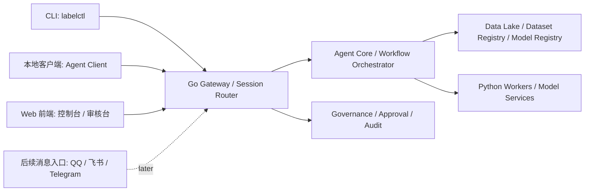

# 三端界面设计

版本：v0.1  
日期：2026-06-02  
定位：先设计 CLI、本地客户端、Web 前端三类入口，后续再接 QQ、飞书、Telegram 等消息平台。

## 1. 当前状态

| 入口 | 当前是否存在 | 当前代码 | 结论 |
| --- | --- | --- | --- |
| CLI | 已存在 | `cmd/labelctl`、`internal/cli/labelctl` | 已经是当前 Agent 主入口，但命令还需要继续补齐。 |
| 本地客户端 | 暂无独立实现 | 暂无 | 需要先定义为轻量 Agent Client，不直接承载业务核心。 |
| Web 前端 | 已存在 | `web` | 已有视频审核、数据接入、任务和 Agent 控制面，但首页仍偏标注工作台。 |

三端都必须连接同一个 Go Gateway / Agent Control Plane，不允许各自绕过后端直接操作数据、模型或 worker。



## 2. CLI Agent 界面

### 定位

CLI 是主入口，负责对话、规划、执行、自动化和脚本集成。它适合研发机器、服务器、CI、远程 SSH 和批处理场景。

### 技术方案

- 语言：Go。
- 程序：`labelctl`。
- 交互模式：
  - command mode：确定性命令。
  - agent mode：自然语言规划，加确认后执行。
  - auto mode：受治理策略约束的自动执行。
- 输出：
  - 默认 JSON，便于脚本解析。
  - 后续增加 table / compact / jsonl。

### 信息架构

```text
labelctl
  health                         服务健康检查
  datasets                       数据集列表
  dataset register-folder        注册本地数据集
  dataset register-manifest      注册 manifest 数据集
  workflows                      工作流列表
  agent run                      提交 Agent 生命周期工作流
  runs                           查看 Agent run
  governance all                 查看治理控制面
  models                         查看模型注册表
  deploy                         提交部署或回滚请求
  ask                            一次性 LLM 问答
  agent                          交互式 Agent 会话
```

### CLI 主界面草图

```text
Automated Training Model CLI

atm> status
Service      http://127.0.0.1:7870    healthy
Dataset      shanghaitech-original     315850 files / 4.64 GiB
Workflow     data-to-deployment        ready
Queue        1 queued / 0 running
Governance   release gate enabled

atm> run data-to-deployment --dataset shanghaitech-original --dry-run
Plan
  1. profile dataset
  2. validate governance policy
  3. curate samples
  4. label or review
  5. train
  6. evaluate
  7. release gate
  8. deploy dry-run

execute? [y/N]
```

### 下一步补齐

- `dataset` 命令组。
- `models` 命令组。
- `deploy` 命令组。
- `logs --run <id>`。
- `doctor`，检查 Go 服务、Data Lake、Python worker、LLM provider、模型目录。

## 3. 本地客户端界面

### 定位

本地客户端不是另一个业务后端，而是面向研发人员和标注/训练操作员的轻量 Agent Client。它提供比 CLI 更友好的任务面板、日志查看、审批、数据集选择和模型产物浏览。

### 推荐技术方案

短期设计为两阶段：

1. **MVP 客户端：Go TUI**
   - 使用 Go 构建终端 UI。
   - 与 `labelctl` 共用 CLI service。
   - 适合服务器、SSH 和研发工作流。

2. **桌面客户端：Tauri + TypeScript/React**
   - UI 继续使用 TypeScript/React，复用 Web 组件。
   - Rust 只作为本地壳、文件权限、系统托盘、离线缓存和安全边界。
   - 仍然通过 HTTP/WebSocket 连接 Go Gateway。

不建议用 Rust/WASM 重写主前端。WASM 只用于轨迹几何、IoU、mask/RLE、大文件索引等热点计算。

### 客户端首页草图

```text
┌────────────────────────────────────────────────────────────────────┐
│ Automated Training Model Agent Client                              │
├───────────────┬───────────────────────────────┬────────────────────┤
│ 工作区         │ Agent 会话                      │ 当前上下文          │
│               │                               │                    │
│ 数据集          │ 你要做什么？                    │ Dataset            │
│ - shanghai     │ > 检查数据并启动 dry-run 训练     │ shanghaitech       │
│ - custom       │                               │                    │
│               │ Plan                          │ Scene              │
│ 工作流          │ 1 数据画像                      │ 01_0016            │
│ - 全生命周期     │ 2 治理检查                      │                    │
│ - 自动标注       │ 3 自动标注/人工复核              │ Run                │
│ - 训练评估       │ 4 训练评估                      │ queued             │
│               │                               │                    │
│ 模型            │ [执行] [只预演] [打开日志]        │ Approval           │
│ - registry     │                               │ release gate       │
└───────────────┴───────────────────────────────┴────────────────────┘
```

### 核心页面

| 页面 | 作用 |
| --- | --- |
| Agent Chat | 自然语言任务入口、计划预览、执行确认。 |
| Run Center | 运行队列、日志、失败原因、重试、取消。 |
| Dataset Center | 数据集注册、版本、血缘、质量检查。 |
| Model Center | checkpoint、评估报告、模型注册、发布状态。 |
| Approval Inbox | 高风险操作、发布门禁、数据导出审批。 |
| Settings | Gateway 地址、LLM provider、工作区、权限 token。 |

## 4. Web 前端界面

### 定位

Web 是团队控制台和人工审核面，适合浏览器访问、可视化数据、视频审核、任务监控、治理审计和发布审批。

当前 Web 已经存在，但产品重心要从“视频标注页面”升级为“Agent 控制台 + 数据审核工作台”。

### 技术方案

- TypeScript + React + Vite。
- TanStack Query 管理服务端状态。
- Zustand 管理当前工作台状态。
- FSD / 前端 DDD 分层。
- Canvas / WASM 用于视频帧、轨迹和 mask 热点计算。

### Web 首页布局

```text
┌────────────────────────────────────────────────────────────────────┐
│ 顶部：项目 / 数据集 / 当前 Run / 全局搜索 / 用户与权限              │
├──────────────┬──────────────────────────────────────┬──────────────┤
│ 左侧导航      │ 主工作区                               │ 右侧上下文     │
│              │                                      │              │
│ Agent 总览    │ Agent Lifecycle Board                 │ 当前数据集      │
│ 数据湖         │ collect -> govern -> label -> train  │ 当前模型        │
│ 标注审核       │ -> evaluate -> release -> deploy      │ 审批队列        │
│ 训练任务       │                                      │ 风险提示        │
│ 评估报告       │ Cards: runs, datasets, models, gates  │ 审计摘要        │
│ 模型注册       │                                      │              │
│ 部署监控       │                                      │              │
└──────────────┴──────────────────────────────────────┴──────────────┘
```

### Web 页面分区

| 页面 | 功能 |
| --- | --- |
| Agent Overview | 生命周期工作流总览、运行状态、关键指标。 |
| Data Lake | 数据集注册、版本、目录、质量报告、血缘。 |
| Review Workbench | 当前已有的视频、tracking、对象级异常审核。 |
| Task Center | 自动标注、训练、评估、部署任务列表和日志。 |
| Model Registry | 模型版本、指标、artifact、发布状态。 |
| Deployment Center | 部署环境、灰度、回滚、线上监控。 |
| Governance | 策略、审批、审计、成本、权限、风险事件。 |

### 当前 Web 需要调整

- 把 `AnnotationWorkbenchPage` 从唯一首页降级为 `Review Workbench` 页面。
- 新增 `Agent Overview` 作为默认首页。
- 把 `TaskMonitorPanel` 拆成独立 `Task Center` 页面。
- 把 `AgentControlPanel` 拆成独立 `Agent Overview / Governance` 页面。
- 增加顶部全局运行状态栏。

## 5. 三端职责边界

| 能力 | CLI | 本地客户端 | Web 前端 |
| --- | --- | --- | --- |
| 自然语言 Agent | 主入口 | 主入口 | 辅助入口 |
| 批处理和 CI | 主入口 | 不承担 | 不承担 |
| 数据审核 | 可触发 | 可查看 | 主入口 |
| 视频/Canvas 标注 | 不承担 | 可打开 Web | 主入口 |
| 任务日志 | 支持 | 主入口 | 主入口 |
| 发布审批 | 支持 | 主入口 | 主入口 |
| 模型注册 | 支持 | 主入口 | 主入口 |
| 团队协作 | API/脚本 | 单人/小团队 | 主入口 |
| 消息平台接入 | 不直接承担 | 不直接承担 | 不直接承担 |

当前先实现 QQ。飞书、Telegram 后续都属于入口适配器，统一走 Gateway：

```text
QQ
  -> Channel Adapter
  -> Gateway
  -> Session Runner
  -> Agent Core
  -> Governance
  -> Tool / Workflow
```

QQ 详细设计见 [QQ_CHANNEL_SDD.md](QQ_CHANNEL_SDD.md)。后续新增飞书、Telegram 时复用同一套 Channel Contract。

Channel 也可以传输数据给系统，例如图片、zip、manifest、CSV/JSON。数据接入由 LLM Agent 生成结构化计划，执行必须经过隔离区、治理和审批，详见 [CHANNEL_DATA_INGEST_SDD.md](CHANNEL_DATA_INGEST_SDD.md)。

## 6. 实施顺序

1. 补齐 CLI 命令组：dataset、models、deploy、logs、doctor。
2. 新增 Web 默认首页 `Agent Overview`，保留当前视频审核为 `Review Workbench`。
3. 抽出 `Task Center`、`Model Registry`、`Governance` 页面。
4. 实现 Go TUI 版本地客户端，复用 `internal/cli/labelctl` service。
5. 再评估是否需要 Tauri 桌面客户端。
6. 先接 QQ channel adapter，稳定后再加入飞书、Telegram。
