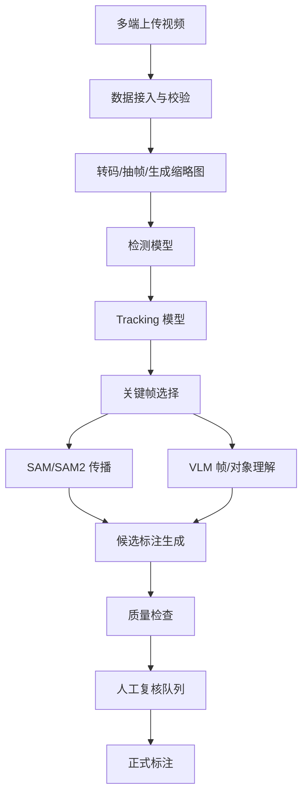

# 多端数据接入、自动标注与二次元风格 UI 需求扩展

版本：v0.1  
日期：2026-05-31  
适用文档：`PRODUCT_DOCUMENT_DDD_SDD.md`、`PLATFORM_REQUIREMENTS_ARCHITECTURE_ANALYSIS.md`

## 1. 新增产品定位

平台不应只被定义为“视频标注工具”，而应定义为：

> 一个二次元风格的人机协同视频标注智能体平台。它支持用户从网页、桌面、手机和群聊渠道提交视频数据，并可选择人工标注、大模型辅助标注或自动标注流程，最终生成可审核、可追溯、可导出的对象级视频标注数据。

新增能力关键词：

- 人工标注。
- 大模型辅助标注。
- 自动标注。
- 多端数据接入。
- 二次元视觉风格。
- 手机端轻量审核。
- 群聊触发任务。
- 自动标注结果人工复核。

## 2. 标注模式设计

平台必须同时支持三种标注模式。

### 2.1 人工标注模式

适合高质量数据集建设。

特点：

- 用户手动选择视频、时间段、对象、异常事件。
- 用户手动删除误检 tracking。
- 用户手动填写异常原因、对象外貌、行为描述。
- 系统只负责可视化、校验、保存、导出。

正式训练数据默认来自人工标注模式或人工确认后的 AI 标注。

### 2.2 AI 辅助标注模式

适合提高标注效率，但仍保留人工控制权。

流程：

```text
用户选择视频/片段
  -> Agent 挑选关键帧
  -> 检测/追踪/SAM/VLM/LLM 生成候选
  -> 前端展示候选异常事件、候选对象、候选描述
  -> 人工接受、修改或拒绝
  -> accepted 后进入正式标注
```

原则：

- 大模型输出默认是 `suggested`。
- 用户确认后才变为 `accepted`。
- 被拒绝建议进入 memory，用于后续优化 prompt/skill。
- 模型建议需要带证据：关键帧、bbox、track id、置信度、模型名称。

### 2.3 自动标注模式

适合批量预处理和弱标签生成。

流程：

```text
多端上传视频
  -> 自动入库
  -> 自动抽帧/转码
  -> 自动检测与 tracking
  -> 自动关键帧选择
  -> 自动 SAM/视频传播
  -> 自动 VLM/LLM 生成候选事件
  -> 自动质量检查
  -> 进入待审核队列
```

自动标注必须有安全等级：

| 等级 | 名称 | 行为 |
| --- | --- | --- |
| L0 | 关闭 | 只导入数据，不做模型处理 |
| L1 | 自动预处理 | 抽帧、转码、生成缩略图 |
| L2 | 自动 tracking | 生成检测框和轨迹 |
| L3 | 自动候选标注 | 生成异常片段、事件和对象建议 |
| L4 | 自动接受低风险标注 | 仅对高置信、低风险、规则允许的结果自动接受 |
| L5 | 全自动写正式数据 | 默认不建议启用，只能在沙箱或弱标签任务中使用 |

推荐默认：

```text
默认开启 L1-L3。
L4 需要项目管理员启用。
L5 不作为普通产品默认能力。
```

## 3. 多端数据接入需求

### 3.1 接入渠道

平台需要支持：

- Web 上传。
- 桌面端本地目录导入。
- 手机端上传。
- 微信。
- QQ。
- 飞书。
- Telegram。
- Webhook/API。

### 3.2 群聊接入职责

群聊入口不承担复杂标注，只负责数据入口和轻量任务交互：

- 上传视频或图片。
- 上传 zip 数据包。
- 发送数据集链接。
- @bot 创建标注任务。
- 查询任务状态。
- 接收自动标注完成通知。
- 快速回复：接受、拒绝、需要人工复核。
- 点击链接跳转 Web/手机端继续标注。

### 3.3 群聊消息处理流程

```text
微信/QQ/飞书/Telegram 消息
  -> Connector Adapter
  -> 消息标准化
  -> 权限校验
  -> 附件下载
  -> 病毒/格式/大小检查
  -> 创建 IngestJob
  -> 自动标注策略判断
  -> 创建标注任务
  -> 返回任务卡片
```

任务卡片示例：

```text
任务：01_0014.mp4 自动标注
状态：tracking 已完成，等待人工审核
候选异常：2 段
待确认对象：6 个
按钮：打开标注页 / 查看关键帧 / 重新标注 / 忽略
```

### 3.4 各平台差异

| 平台 | 推荐接入方式 | 风险点 |
| --- | --- | --- |
| Telegram | Bot API | 海外网络与代理 |
| 飞书 | 飞书机器人/开放平台 | 企业权限配置 |
| QQ | 官方机器人或可用 SDK | 协议稳定性和账号限制 |
| 微信 | 企业微信/公众号/可用网关 | 普通微信群机器人能力不稳定 |

架构上必须把每个平台做成独立 Connector，不能把平台 SDK 写进核心标注服务。

## 4. 自动标注工作流

### 4.1 标准自动标注流程



### 4.2 自动标注任务配置

每个项目需要允许配置：

```json
{
  "auto_label": {
    "enabled": true,
    "level": "L3",
    "detector": "yolo26x",
    "tracker": "botsort",
    "segmenter": "sam2",
    "vlm": "qwen-vl",
    "llm": "default",
    "min_detection_conf": 0.1,
    "min_track_len": 5,
    "auto_accept_conf": 0.95,
    "require_human_review": true
  }
}
```

### 4.3 自动标注结果状态

```text
generated
  -> suggested
  -> human_reviewing
  -> accepted
  -> rejected
  -> revised
```

正式训练导出只应默认使用：

```text
accepted + revised
```

除非用户显式选择导出弱标签。

## 5. 大模型辅助能力

### 5.1 可调用的大模型能力

- 关键帧语义描述。
- 对象外貌描述。
- 异常事件原因描述。
- 中英文标签转换。
- 标注规范问答。
- 标注一致性检查。
- 根据用户自然语言批量修改标注规则。
- 根据历史拒绝案例优化 prompt 或 skill。

### 5.2 大模型输入约束

给大模型的输入必须结构化，不能把整个长视频无控制地塞进去。

推荐输入：

```json
{
  "video_id": "01_0014",
  "segment": {"start_frame": 155, "end_frame": 230},
  "keyframes": [
    {"frame": 155, "image_url": "..."},
    {"frame": 186, "image_url": "..."},
    {"frame": 230, "image_url": "..."}
  ],
  "tracks": [
    {"track_key": "0:6", "class": "person", "first": 1, "last": 265},
    {"track_key": "1:5", "class": "bicycle", "first": 149, "last": 236}
  ],
  "question": "请生成中文对象级异常事件候选。"
}
```

### 5.3 大模型输出约束

输出必须 JSON 化：

```json
{
  "events": [
    {
      "event_type": "bicycle",
      "reason_zh": "有人骑自行车进入人行区域",
      "confidence": 0.82,
      "objects": [
        {"track_key": "0:6", "role_zh": "骑车的人", "appearance_zh": "白色上衣，黑色裤子"},
        {"track_key": "1:5", "role_zh": "自行车", "appearance_zh": "黑色自行车"}
      ]
    }
  ]
}
```

## 6. 二次元风格 UI 需求

### 6.1 视觉定位

界面需要有明显的二次元风格，但不能牺牲标注效率。推荐方向是：

```text
专业标注工作台 + 轻量二次元视觉系统
```

不建议做成纯游戏 UI，也不建议高饱和度堆满屏幕。标注工作台需要长时间使用，必须保证信息密度、对比度和可读性。

### 6.2 设计关键词

- 清爽。
- 科技感。
- 二次元助手。
- 霓虹点缀。
- 柔和渐变。
- 高可读卡片。
- 角色化状态提示。
- 动效轻量。
- 不遮挡标注区域。

### 6.3 色彩系统

建议主题：

```text
主色：青蓝 / 电光蓝
辅助色：樱粉 / 紫罗兰
成功色：薄荷绿
警告色：琥珀黄
危险色：珊瑚红
背景：浅色雾蓝 / 深色夜空双主题
```

类别颜色不能完全服从主题，必须优先保证 bbox 可区分。

### 6.4 二次元元素

可以加入：

- AI 标注助手形象。
- 任务完成动画。
- 模型运行状态小头像。
- “标注精灵”式提示气泡。
- 空状态插画。
- 新手引导角色。
- 质量检查报告的角色化总结。

不能加入：

- 遮挡视频/帧标注区域的大面积角色图。
- 太多漂浮装饰。
- 影响 bbox 可见性的背景花纹。
- 过度动画。

### 6.5 UI 页面结构

#### Web 标注页

```text
左侧：数据集/视频列表
中间：视频帧播放 + bbox/mask/canvas
右侧：当前对象、事件、审核表单
下方：轨迹列表、关键帧、Agent 建议
顶部：任务状态、自动标注开关、保存/导出
```

#### Agent 面板

二次元助手可以集中在 Agent 面板中：

- 当前正在做什么。
- 已挑选关键帧。
- 候选异常事件。
- 置信度。
- 需要人工确认的问题。
- 一键接受 / 修改 / 拒绝。

#### 手机端

手机端以卡片为主：

- 待审核任务卡。
- 关键帧缩略图。
- 候选事件。
- 快速接受/拒绝。
- 跳转 Web 完整编辑。

### 6.6 动效规范

- 任务开始：轻微发光。
- Agent 思考：小头像呼吸动画。
- 建议生成：卡片滑入。
- 保存成功：短暂高亮。
- 错误：清晰红色提示。

禁止长时间循环高频动画。

## 7. 多端前端产品形态

### 7.1 Web 端

主力生产力工具。

必须支持完整功能：

- 标注。
- 审核。
- 自动标注配置。
- Agent 建议审核。
- 导出。
- 任务管理。

### 7.2 桌面端

适合本地大数据和 GPU 推理。

能力：

- 本地目录拖入。
- 本地模型管理。
- 本地缓存。
- 离线标注。
- 自动启动 Go 后端和模型 worker。

### 7.3 手机端

适合轻量审核。

能力：

- 查看自动标注结果。
- 查看关键帧。
- 接受/拒绝候选。
- 接收通知。
- 上传短视频。

### 7.4 群聊端

适合任务入口和通知。

能力：

- 上传视频。
- @bot 创建自动标注任务。
- 查询状态。
- 快速反馈。

## 8. 新增架构组件

### 8.1 AutoLabel Orchestrator

职责：

- 根据项目配置决定是否自动标注。
- 编排检测、追踪、关键帧、SAM、VLM、LLM。
- 把结果写成 suggestion。
- 触发通知。

### 8.2 Connector Gateway

职责：

- 管理微信、QQ、飞书、Telegram adapter。
- 标准化消息。
- 下载附件。
- 做权限检查。
- 创建 ingest job。

### 8.3 UI Theme System

职责：

- 管理二次元主题。
- 管理亮色/暗色主题。
- 管理 bbox 类别颜色。
- 管理角色助手资源。

### 8.4 Suggestion Review Center

职责：

- 展示自动标注结果。
- 支持接受、拒绝、编辑。
- 记录人工反馈。
- 写入 memory。

## 9. 推荐实施顺序

### Step 1：补齐产品设计

- 把当前视频标注功能整理成正式信息架构。
- 定义二次元视觉风格规范。
- 定义自动标注配置 schema。
- 定义多端接入 schema。

### Step 2：先做 Web 端漂亮版

- 保留现有核心功能。
- 重做布局与视觉系统。
- 加 Agent 面板占位。
- 加自动标注配置入口。

### Step 3：做自动标注最小闭环

- 上传视频。
- 自动抽帧。
- 自动 tracking。
- 生成候选。
- 人工确认。

### Step 4：接入群聊

- 先 Telegram / 飞书。
- 再 QQ。
- 微信建议最后做，因为普通微信群接入不稳定。

### Step 5：手机端与桌面端

- 手机端先 PWA。
- 桌面端用 Wails 包装 Go 后端 + Web UI。

### Step 6：自进化

- 先让 Agent 生成 prompt/skill 改进建议。
- 后续再做 sandbox 自动测试和人工审批发布。

## 10. 产品核心差异化

相比普通 Label Studio / CVAT，本平台的差异化是：

- 原生对象级视频异常标注。
- 原生 track-centric 数据模型。
- Agent + Memory + Skill + MCP 扩展。
- 多端数据接入。
- 自动标注可控闭环。
- 面向大模型训练和 object query / anomaly query 训练数据导出。
- 二次元风格、低门槛、高亲和力的前端体验。

