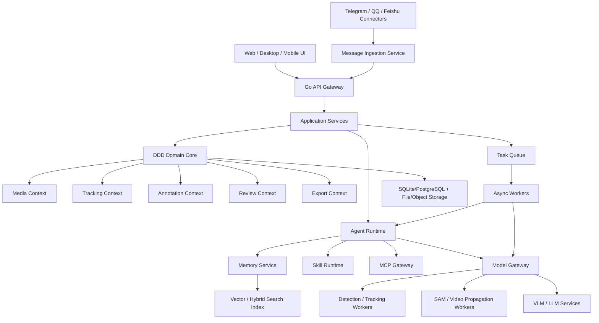

# 通用视频打标智能体平台：需求与架构分析

版本：v0.1  
日期：2026-05-31  
定位：从单一视频标注工具升级为支持 Memory、Skill、MCP、群聊入口、自进化和多端访问的智能体标注平台

## 1. 总体判断

现在的需求已经不再是“做一个网页标注工具”，而是一个完整的 **Video Labeling Agent Platform**：

```text
视频标注核心系统
  + Agent 工作流
  + Memory 长短期记忆
  + Skill 可扩展能力包
  + MCP 外部工具协议
  + SAM/检测/追踪/VLM/LLM 模型网关
  + Telegram/QQ/飞书等消息入口
  + 手机端/网页端/桌面端
  + 自进化能力
```

最关键的架构原则是：**标注领域核心必须稳定，智能体能力必须外挂化。**

也就是说，视频、轨迹、异常事件、标注、审核、导出这些核心业务不能和 Telegram、QQ、MCP、LLM prompt、SAM 推理代码混在一起。否则后续每接一个模型或群聊平台，核心标注逻辑都会被污染。

建议产品定位为：

> 一个面向视频数据集构建的多端人机协同标注平台。它以对象轨迹、异常事件和时空片段为核心数据模型，通过 Agent、Memory、Skill 和 MCP 扩展模型辅助标注、自动质检、跨平台数据接入和可控自进化。

## 2. 产品需求重新分层

### 2.1 第一层：视频标注工作台

这是当前 ShanghaiTech 原型已经具备雏形的部分。

核心能力：

- 视频/帧序列浏览。
- Tracking bbox 展示。
- 轨迹审核。
- 删除误检轨迹。
- 对象级异常事件标注。
- 帧级异常片段管理。
- JSONL/CSV/MOT 导出。

这部分必须本地稳定、低延迟、可离线使用。

### 2.2 第二层：模型辅助标注

模型能力不能直接写正式标注，只能生成候选。

核心能力：

- YOLO / RT-DETR / GroundingDINO 检测。
- BoT-SORT / ByteTrack / MOTR-style 跟踪。
- SAM / SAM2 / XMem / DeAOT 等视频分割传播。
- Qwen-VL / InternVL / GPT-Vision 等视觉语言模型理解。
- LLM 生成异常描述、对象外貌描述、事件摘要。

输出形态：

```text
model output -> candidate annotation -> human review -> accepted annotation
```

### 2.3 第三层：Agent 工作流

Agent 是流程编排者，不是核心数据模型。

Agent 负责任务：

- 自动挑选关键帧。
- 调模型生成候选框/候选 mask。
- 调 VLM 描述对象和事件。
- 调 LLM 生成中文/英文标注建议。
- 检查标注冲突。
- 根据训练失败样本回流标注任务。
- 将群聊里收到的视频或反馈转成标注任务。

### 2.4 第四层：Memory

Memory 让平台记住长期上下文，而不是每次都从零开始。

Memory 类型：

- Project Memory：当前数据集、类别体系、标注规范、异常类型定义。
- User Memory：某个标注员习惯、常用修正、审核偏好。
- Dataset Memory：视频级统计、常见错误、类别分布、难例列表。
- Model Memory：不同模型在不同数据集上的效果、失败模式、最佳参数。
- Agent Episodic Memory：每次 Agent 任务的过程、工具调用、人工接受/拒绝结果。
- Knowledge Memory：标注指南、论文方法、模型接口说明、历史实验结论。

Memory 不是一个简单向量库，而是多层存储：

```text
短期会话记忆
  -> 当前标注任务上下文

结构化项目记忆
  -> SQLite/PostgreSQL 表

语义检索记忆
  -> 向量库 / hybrid search

审计记忆
  -> append-only JSONL / event log
```

### 2.5 第五层：Skill

Skill 是可安装、可版本化、可复用的能力包。

示例：

- `shanghaitech-anomaly-schema`：ShanghaiTech 异常类别和标注规则。
- `tracking-cleanup`：检测重复轨迹、短轨迹、低置信轨迹。
- `sam-propagation`：从 bbox/point 调 SAM2 传播。
- `vlm-caption`：关键帧视觉描述。
- `object-appearance-zh`：中文外貌标注建议。
- `export-sttrb-training`：导出 object query / track query / anomaly query 训练格式。
- `quality-audit`：标注完整性检查。

Skill 必须包含：

```text
manifest
  name
  version
  input schema
  output schema
  required tools
  permissions
  prompt templates
  tests
```

### 2.6 第六层：MCP

MCP 用来接入外部工具和数据源。

平台中的 MCP 角色：

- 文件系统工具。
- 数据库工具。
- 模型服务工具。
- Git/GitHub 工具。
- 标注任务管理工具。
- 消息平台工具。
- 实验训练工具。

设计原则：

- MCP 工具只暴露受控能力。
- Agent 调 MCP 需要权限检查。
- 工具调用结果必须进入 task log。
- 高风险工具调用需要人工确认。

### 2.7 第七层：多端入口

需要支持：

- Web 端：主力标注工作台。
- 桌面端：本地数据集、大模型、本地 GPU 推理、文件系统深度集成。
- 手机端：轻量审核、接收任务、快速确认、查看模型建议。
- 群聊端：Telegram、QQ、飞书等消息平台收集数据和反馈。

不同端的职责不同：

| 端 | 主要职责 |
| --- | --- |
| Web | 完整标注、审核、导出、任务管理 |
| Desktop | 本地大数据、GPU 模型、离线推理、文件管理 |
| Mobile | 轻量查看、确认、驳回、任务提醒 |
| Group Chat | 上传视频、接收任务通知、快速反馈、触发 Agent |

## 3. 推荐总体架构



核心思想：

- Go 后端负责 API、领域模型、任务管理、权限、文件索引。
- Python/独立模型服务负责 GPU 推理。
- Agent Runtime 负责复杂流程编排。
- Skill Runtime 负责能力包加载和执行。
- MCP Gateway 负责外部工具接入。
- Connectors 负责消息平台，不直接碰标注数据库。

## 4. DDD Bounded Context 扩展

在原先视频标注 DDD 之外，需要新增几个上下文。

### 4.1 Identity & Workspace Context

职责：

- 用户。
- 组织。
- 工作空间。
- 权限。
- API token。
- 外部账号绑定。

核心实体：

- User
- Workspace
- Role
- Permission
- ExternalAccount

### 4.2 Media Context

职责：

- 视频。
- 帧。
- 片段。
- 媒体转码。
- 缩略图。
- 低清代理视频。

核心实体：

- Dataset
- Video
- Frame
- ClipSegment
- MediaAsset

### 4.3 Tracking Context

职责：

- 检测框。
- 轨迹。
- 类别映射。
- tracking 审核。
- 轨迹删除、恢复、合并、拆分。

核心实体：

- Track
- DetectionBox
- ClassMap
- TrackReview
- TrackRevision

### 4.4 Annotation Context

职责：

- 异常片段。
- 异常事件。
- 事件对象。
- 外貌描述。
- 语义标签。

核心实体：

- AnomalySegment
- AnomalyEvent
- EventObject
- AppearanceDescriptor
- LabelSchema

### 4.5 Agent Context

职责：

- Agent 工作流。
- Agent 任务。
- 工具调用。
- 模型建议。
- 人工接受/拒绝。

核心实体：

- AgentWorkflow
- AgentTask
- ToolCall
- Suggestion
- HumanDecision

不变量：

- Agent 只能生成 `suggestion`。
- 正式标注必须来自人工确认或明确配置的自动规则。
- 高风险操作必须带权限和审计记录。

### 4.6 Memory Context

职责：

- 记忆写入。
- 记忆检索。
- 记忆版本。
- 记忆过期。
- 记忆可信度。

核心实体：

- MemoryItem
- MemorySource
- MemoryScope
- MemoryEmbedding
- MemoryEvidence

关键设计：

```text
memory_scope:
  global
  workspace
  dataset
  video
  task
  user

memory_type:
  episodic
  semantic
  procedural
  preference
  audit
```

### 4.7 Skill Context

职责：

- skill 安装。
- skill manifest。
- skill 版本。
- skill 权限。
- skill 运行结果。

核心实体：

- SkillPackage
- SkillVersion
- SkillManifest
- SkillRun
- SkillPermission

### 4.8 MCP Context

职责：

- MCP server 注册。
- tool schema 同步。
- 工具调用代理。
- 权限隔离。
- 调用日志。

核心实体：

- MCPServer
- MCPTool
- MCPCall
- MCPCredential

### 4.9 Connector Context

职责：

- Telegram / QQ / 飞书 / 邮件 / Webhook 数据接入。
- 消息解析。
- 附件下载。
- 群聊权限。
- 通知发送。

核心实体：

- Connector
- Channel
- Message
- Attachment
- IngestJob
- Notification

## 5. Go 后端模块建议

```text
/cmd/labelserver
  main.go

/internal/domain
  identity/
  media/
  tracking/
  annotation/
  agent/
  memory/
  skill/
  mcp/
  connector/
  export/

/internal/application
  media_service.go
  tracking_service.go
  annotation_service.go
  agent_service.go
  memory_service.go
  skill_service.go
  mcp_service.go
  connector_service.go

/internal/infrastructure
  filesystem/
  sqlite/
  postgres/
  objectstore/
  vectorstore/
  modelgateway/
  mcpclient/
  connectors/
    telegram/
    feishu/
    qq/

/internal/interfaces
  http/
  websocket/
  grpc/
  cli/

/web
  app/
  mobile/
  desktop/
```

Go 服务职责边界：

- 维护领域一致性。
- 管理任务队列。
- 管理文件索引和数据库。
- 管理权限和审计。
- 对接前端。
- 调用模型网关和 MCP。

不建议 Go 直接承载所有深度学习推理。SAM、YOLO、VLM 这类 GPU 任务应通过模型网关调用 Python worker 或独立服务。

## 6. Agent Runtime 设计

### 6.1 Agent 运行模型

Agent 不是一个“聊天机器人”，而是工作流执行器。

```text
Trigger
  -> Context Builder
  -> Memory Retrieval
  -> Skill Selection
  -> Tool/MCP Planning
  -> Tool Execution
  -> Suggestion Generation
  -> Human Review
  -> Memory Writeback
```

### 6.2 Agent 输入来源

- 用户在 Web 端点击按钮。
- 用户在手机端确认任务。
- 群聊上传视频。
- 群聊 @bot 触发任务。
- 定时任务扫描低质量标注。
- 训练过程发现 bad cases。
- 新模型输出候选结果。

### 6.3 Agent 输出类型

- Candidate Track Review。
- Candidate Anomaly Event。
- Candidate Event Object。
- Candidate Appearance Description。
- Candidate Segment。
- Candidate Keyframe。
- Quality Report。
- Training Data Export Report。

所有输出必须带：

```text
source_agent
source_model
confidence
evidence
tool_calls
human_status
```

## 7. Memory 设计

### 7.1 为什么需要 Memory

视频标注不是一次性任务。平台需要逐渐记住：

- 当前项目的类别定义。
- 这个数据集中“自行车进入校园步道”如何标。
- 哪些 track 通常是误检。
- 哪些模型参数在本数据集上效果最好。
- 标注员经常如何修正模型建议。
- 哪些视频是难例。
- 训练中哪些错误需要回流标注。

### 7.2 Memory 存储分层

```text
Hot Memory
  当前会话、当前视频、当前任务上下文。

Structured Memory
  数据库表，存储任务、标签、审核、统计、用户偏好。

Semantic Memory
  向量库或 hybrid index，用于检索历史相似事件、标注规范、模型失败案例。

Audit Memory
  append-only event log，用于追责和回滚。
```

### 7.3 Memory 写入规则

不是所有内容都应该写入长期记忆。

应写入：

- 人工接受的标注规范。
- 人工多次重复修正的模式。
- 模型参数实验结果。
- 质量检查结论。
- 数据集级统计。

不应直接写入：

- 未确认的大模型猜测。
- 临时错误结果。
- 含敏感信息的群聊原文。
- 没有 evidence 的推断。

## 8. Skill 设计

### 8.1 Skill 的作用

Skill 是把专家流程封装成可调用能力。

例如：

```text
技能：ShanghaiTech 对象异常标注
输入：video_id, segment, tracks, keyframes
输出：候选事件类型、相关对象、中文描述
依赖：VLM, tracking index, mask segments
```

### 8.2 Skill Manifest 示例

```json
{
  "name": "shanghaitech-object-anomaly",
  "version": "0.1.0",
  "description": "生成 ShanghaiTech 对象级异常候选标注",
  "inputs": {
    "video_id": "string",
    "segment_id": "string",
    "keyframes": "number[]"
  },
  "outputs": {
    "events": "AnomalyEventSuggestion[]"
  },
  "permissions": [
    "read:video",
    "read:tracking",
    "call:vlm",
    "write:suggestion"
  ],
  "tools": [
    "video.get_frame",
    "tracking.list_tracks",
    "vlm.describe_frame"
  ]
}
```

### 8.3 Skill 生命周期

```text
installed -> enabled -> selected -> running -> completed/failed -> evaluated
```

每个 Skill 需要有测试样例，避免自进化修改后悄悄破坏行为。

## 9. MCP 设计

### 9.1 MCP 在平台中的位置

MCP 是 Agent Runtime 与外部工具之间的标准化边界。

```text
Agent Runtime
  -> MCP Gateway
      -> Filesystem MCP
      -> Model MCP
      -> Database MCP
      -> Git MCP
      -> Messaging MCP
      -> Training MCP
```

### 9.2 工具权限分级

| 等级 | 示例 | 是否需要人工确认 |
| --- | --- | --- |
| Read | 读取视频 meta、读取标注 | 否 |
| Suggest | 生成候选标注 | 否 |
| Write Draft | 写 suggestion | 否或可配置 |
| Write Accepted | 写正式标注 | 是，除非规则自动化 |
| Destructive | 删除源 tracking、覆盖文件 | 必须确认 |
| External Send | 发群聊、上传数据 | 必须确认或预授权 |

### 9.3 MCP 调用审计

每次工具调用记录：

- agent_task_id
- tool_name
- input hash
- output hash
- started_at
- finished_at
- status
- error
- permission decision

## 10. 群聊入口设计

### 10.1 支持平台

- Telegram。
- QQ。
- 飞书。
- 企业微信或普通微信可作为后续扩展。

### 10.2 群聊能力

群聊不是完整标注入口，而是任务触发和轻量反馈入口。

支持：

- 上传视频，自动创建待处理任务。
- 发送视频链接，自动下载并入库。
- @bot 询问某个视频标注进度。
- 接收模型处理完成通知。
- 接收质量检查报告。
- 快速回复“接受/拒绝/需要人工复核”。

不建议在群聊中做复杂标注。复杂标注应跳转 Web/Mobile。

### 10.3 消息接入流程

```text
Group Message
  -> Connector Worker
  -> Message Normalizer
  -> Attachment Downloader
  -> Permission Check
  -> Ingest Job
  -> Dataset/Task Creation
  -> Agent Workflow
  -> Notification Back
```

### 10.4 风险

基于本机之前 Hermes/Weixin 网关经验，Windows 上消息网关需要特别注意：

- 网关进程必须可常驻。
- QR 登录或 token 凭据要可靠持久化。
- 群聊能力可能受平台账号类型限制。
- 不能把“启动日志出现”当成“网关长期运行成功”。
- 建议每个 connector 独立进程化，并由 supervisor 监控。

## 11. 多端架构

### 11.1 Web 端

主力端。

功能：

- 完整标注。
- 数据管理。
- 模型任务。
- Agent suggestion review。
- 导出。

### 11.2 桌面端

建议用 Go 生态的 Wails 或 Tauri + Go sidecar。

功能：

- 本地文件系统访问。
- 本地 GPU 模型管理。
- 大视频转码。
- 离线标注。
- 后台任务常驻。

桌面端可以内置同一个 Go API 服务，前端复用 Web UI。

### 11.3 手机端

建议先做 PWA，再考虑原生 App。

功能：

- 任务列表。
- 视频片段轻量预览。
- 模型建议确认/驳回。
- 群聊任务跳转。
- 进度通知。

不建议手机端承担复杂 bbox 编辑。

### 11.4 群聊端

群聊端只做：

- 数据入口。
- 通知入口。
- 快速决策入口。

## 12. 自进化设计

### 12.1 自进化的合理边界

自进化不能等同于“系统自动改生产代码并上线”。在标注平台里，自进化应当是受控闭环：

```text
发现问题
  -> 生成改进建议
  -> 在沙箱中修改 skill/prompt/config
  -> 运行回归测试
  -> 小样本回放验证
  -> 人工审批
  -> 版本化发布
  -> 监控效果
```

### 12.2 可以自进化的内容

适合自动迭代：

- prompt 模板。
- skill 配置。
- 模型参数建议。
- 关键帧选择策略。
- 质量检查规则。
- 数据导出映射。
- UI 布局偏好。

不适合自动直接修改：

- 正式标注数据。
- 源 tracking CSV。
- 用户权限。
- 生产数据库 schema。
- 高风险删除逻辑。

### 12.3 自进化 Agent 工作流

```text
Metrics Monitor
  -> 找到低接受率/高返工率/高错误率环节
  -> Evolution Agent 生成候选改动
  -> Patch Sandbox 应用改动
  -> Replay Benchmark 运行历史任务
  -> Quality Gate 检查指标
  -> Human Approval
  -> Publish New Skill Version
```

### 12.4 自进化验收指标

- 模型建议人工接受率提升。
- 标注耗时下降。
- 质量检查错误率下降。
- 标注一致性提升。
- 不引入数据破坏。

## 13. 关键数据流

### 13.1 人工标注数据流

```text
用户打开视频
  -> 查询 frame / tracks / annotations
  -> 点击对象
  -> 创建事件或审核动作
  -> 保存 annotation
  -> 写 audit log
  -> 更新 memory
```

### 13.2 Agent 辅助标注数据流

```text
用户锁定异常片段
  -> 创建 agent task
  -> 检索 memory 与标注规范
  -> 选择 skill
  -> 调用 VLM/SAM/MCP 工具
  -> 生成 suggestion
  -> 用户接受/修改/拒绝
  -> 写正式标注和 feedback memory
```

### 13.3 群聊数据接入数据流

```text
群聊上传视频
  -> Connector 下载附件
  -> 创建 ingest job
  -> 转码和抽帧
  -> 自动 tracking
  -> 生成标注任务
  -> 通知 Web/Mobile/群聊
```

### 13.4 训练闭环数据流

```text
导出训练数据
  -> 训练 object query / track query / anomaly query
  -> 评估 bad cases
  -> bad cases 回流平台
  -> Agent 生成复核任务
  -> 人工修正
  -> 重新导出
```

## 14. 推荐技术栈

### 14.1 后端

- Go：核心 API、DDD、任务调度、权限、审计。
- SQLite：单机版。
- PostgreSQL：团队版。
- Badger/SQLite FTS/Meilisearch：本地检索可选。
- 向量库：Qdrant / Milvus / sqlite-vss / pgvector。
- Redis/NATS：正式异步队列可选。

### 14.2 模型服务

- Python FastAPI/gRPC worker。
- GPU worker 独立进程。
- SAM/SAM2 worker。
- YOLO/Tracking worker。
- VLM/LLM gateway。

### 14.3 前端

- Web：React/Vue/Svelte 任选，建议组件化重构。
- Desktop：Wails 更贴合 Go 后端。
- Mobile：PWA 起步，后续 React Native/Flutter。

### 14.4 消息连接器

- Telegram Bot API。
- 飞书开放平台。
- QQ 需要按可用 SDK/机器人平台隔离，不能强耦合核心服务。

## 15. 权限与安全

### 15.1 权限模型

```text
workspace role:
  owner
  admin
  annotator
  reviewer
  viewer
  agent

resource:
  dataset
  video
  track
  annotation
  model_task
  export
  connector
```

### 15.2 高风险操作

必须确认并审计：

- 彻底删除 tracking 源数据。
- 覆盖正式标注。
- 向群聊发送敏感数据。
- 上传视频到外部模型 API。
- 安装新 skill。
- 启用自进化自动发布。

## 16. 架构优先级

### P0：稳定标注核心

- DDD 重构。
- 数据模型统一。
- Tracking 审核与对象异常标注稳定。
- JSONL/CSV/MOT 导入导出。
- 操作审计和备份。

### P1：模型任务与 Agent Suggestion

- 异步任务队列。
- 模型网关。
- Agent suggestion。
- Memory 基础写入和检索。
- Skill manifest。

### P2：MCP 与多端

- MCP Gateway。
- WebSocket 任务进度。
- PWA 手机端。
- Wails 桌面端。
- Telegram/飞书连接器。

### P3：自进化

- Skill 版本化。
- Prompt/Config 自动候选修改。
- 回归测试。
- 人工审批发布。

## 17. 最大风险与应对

### 17.1 需求过宽

风险：一次性做 Web、桌面、手机、群聊、Agent、自进化，会导致核心标注工具迟迟不可用。

应对：先做单机 Web + Go 后端 + 文件存储，Agent/MCP/Skill 只留接口。

### 17.2 Agent 污染正式标注

风险：模型幻觉或错误工具调用写入正式数据。

应对：Agent 只写 suggestion，人工确认后才转 accepted。

### 17.3 自进化破坏系统

风险：自动改代码或规则后破坏数据。

应对：只允许在 sandbox 修改 skill/prompt/config，必须回放测试和人工批准。

### 17.4 群聊网关不稳定

风险：不同平台 API/账号权限/Windows 运行时导致接收失败。

应对：connector 独立进程化，带健康检查、断线重连、消息去重。

### 17.5 Memory 变成垃圾堆

风险：所有模型猜测都写入记忆，后续检索污染决策。

应对：Memory 分层、可信度、来源、过期策略、人工确认标签。

## 18. 推荐下一步

建议下一步不是马上写大系统，而是先做架构骨架：

1. 把当前 Go 单文件服务拆成 DDD 模块。
2. 定义统一的数据模型和 repository 接口。
3. 增加 task/suggestion/memory/skill/mcp 的最小表结构。
4. 保留现有 UI，但把功能调用改成稳定 API。
5. 加一个最小 Agent workflow：关键帧选择 + 候选异常描述 + 人工接受。
6. 再接 SAM propagation。
7. 最后接群聊 connector 和自进化。

最合理的第一版命名可以是：

```text
LabelForge
VideoLabel Agent
TrackAnnotator
VLabelOS
```

如果目标是科研工具而不是商业产品，可以直接叫：

```text
Object-Centric Video Annotation Agent Platform
```

