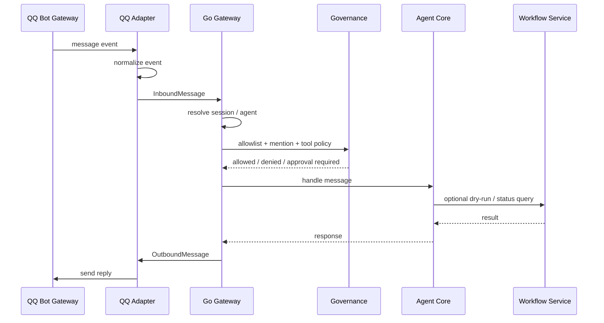

# QQ Channel SDD

版本：v0.1  
日期：2026-06-02  
范围：当前仅设计 QQ 接入。飞书、Telegram、Slack 等后续再作为新的 Channel Adapter 接入。

## 1. 背景与目标

Automated Training Model 的核心是从数据采集到模型部署的 Agent 助手。QQ 不是新的业务核心，也不是新的训练入口，而是一个消息入口：

```text
QQ 私聊 / QQ 群 / QQ 频道
  -> QQ Channel Adapter
  -> Go Gateway
  -> Session Router
  -> Agent Core
  -> Governance
  -> Workflow / Tool / Worker
```

目标：

- 支持通过 QQ 私聊和群聊触发 Agent。
- 支持群聊 @Bot 后进入受控会话。
- 支持查询任务状态、提交 dry-run workflow、查看审批、查看最近运行日志。
- 支持 QQ 文本、图片、zip、manifest 等数据作为受控 Channel 数据入口。
- 高风险操作必须进入审批，不允许 QQ 消息直接执行训练发布、删除数据、部署回滚等动作。
- 后续接飞书、Telegram 时复用同一套 Channel Contract，不改 Agent Core。

非目标：

- 不在 QQ Adapter 里实现训练、标注、模型注册或部署逻辑。
- 不让模型自由选择回包平台，回复必须回到消息来源或显式授权的目标。
- 不让 QQ 上传的数据直接进入正式 Data Lake。所有外部数据必须先进入 quarantine。
- MVP 不做复杂多媒体标注。图片、zip、manifest 先作为受控输入，语音/视频批处理作为后续能力。

## 2. OpenClaw 参考结论

参考 `E:\agent\openclaw` 的 channel 设计，值得吸收的点：

1. **Channel 只是插件/适配器。**  
   平台差异留在 adapter，Agent 路由、会话、工具和审批在核心层。

2. **回复路由必须确定。**  
   入站来自哪个 channel、account、peer，默认就回到同一个位置。模型不决定 channel。

3. **账号必须隔离。**  
   多个 QQ Bot account 的 token、连接、入站队列、出站状态和审计记录不能混用。

4. **群聊必须有策略。**  
   群聊默认 require mention；需要 allowlist、history limit、tool policy 和 per-group prompt。

5. **管理命令必须收紧。**  
   `/bot-me`、`/bot-logs`、`/bot-approve` 这类命令只允许明确 allowlist 的管理员在私聊使用。

6. **审批要走原生消息面。**  
   QQ 可以承载审批提示，但审批动作仍然要落到系统 Approval / Audit 里。

7. **消息归一化很重要。**  
   QQ 的 C2C、群、频道、引用、附件、语音、文件都要转成统一 InboundMessage。

这些结论直接影响我们的拆分方式：QQ Adapter 只能做平台协议、身份、消息、媒体和回包，业务动作必须通过 Go Gateway 的 AgentIngress。

## 3. Go 是否适合负责 QQ 接入

结论：**Go 适合负责 QQ 接入的控制面和运行时主链路。**

Go 应该负责：

- QQ Channel 配置、账号、启停、状态探测。
- AppID / AppSecret 的 SecretRef 解析，不保存明文。
- QQ WebSocket gateway 连接生命周期。
- 入站消息归一化和 session key 构造。
- allowlist、群策略、mention gating、命令拦截。
- 调用 Agent Core 前的治理、审计和审批。
- 出站消息的目标校验、审计和回包。

Go 不应该负责：

- 模型训练、评估、VLM、tracking、segmentation。
- 大模型 provider 的复杂推理 runtime。
- Web/桌面 UI。
- 大型多媒体处理和转码。后续如需语音/视频处理，交给 Python worker 或专用 media worker。

如果官方 QQ Bot API 的协议满足需求，优先用 Go 原生实现。若短期必须依赖成熟 Node SDK，可以把 Node 实现包成外部 sidecar，但 Go 仍然保留 Channel Contract、配置、治理、审计和 AgentIngress。

## 4. 分层设计

```text
入口层
  QQ Bot WebSocket / HTTP Callback

Channel Adapter 层
  QQ account manager
  QQ gateway client
  QQ inbound normalizer
  QQ outbound sender
  QQ group policy
  QQ command handler

Gateway / Session 层
  Channel registry
  Session key resolver
  Agent binding resolver
  Inbound queue
  Reply router

Agent Core 层
  Planner
  Workflow orchestrator
  Tool executor
  Approval gate

治理与状态层
  SecretRef
  Allowlist
  Audit log
  Run log
  Channel status
```

## 5. 核心领域模型

建议新增 `internal/domain/channel`，不要把 QQ 字段直接塞进 `agent` 领域。

```go
type ChannelKind string

const (
    ChannelKindQQ ChannelKind = "qq"
)

type ChannelAccount struct {
    ID              string
    Channel         ChannelKind
    Name            string
    Enabled         bool
    CredentialRef   string
    DefaultAgentID  string
    AllowFrom       []string
    GroupAllowFrom  []string
    CreatedAt       time.Time
    UpdatedAt       time.Time
}

type ChannelPeer struct {
    Channel   ChannelKind
    AccountID string
    Kind      string // c2c, group, channel
    ID        string
    Name      string
}

type InboundMessage struct {
    ID          string
    Channel     ChannelKind
    AccountID   string
    Peer        ChannelPeer
    SenderID    string
    SenderName  string
    Text        string
    Mentioned   bool
    ReplyToID   string
    Attachments []ChannelAttachment
    ReceivedAt  time.Time
}

type OutboundMessage struct {
    Channel   ChannelKind
    AccountID string
    Peer      ChannelPeer
    Text      string
    ReplyToID string
}
```

MVP 先保留文本消息和附件元数据。媒体文件不直接进入 Agent memory，只记录 metadata 和受控文件引用。图片、zip、manifest 等 Channel 数据接入详见 [CHANNEL_DATA_INGEST_SDD.md](CHANNEL_DATA_INGEST_SDD.md)。

## 6. 应用服务与端口

建议新增 `internal/app/channelapp`，定义平台无关接口：

```go
type ChannelRepository interface {
    ListAccounts(ctx context.Context, channel channel.ChannelKind) ([]channel.ChannelAccount, error)
    SaveAccount(ctx context.Context, account channel.ChannelAccount) (channel.ChannelAccount, error)
    GetAccount(ctx context.Context, channel channel.ChannelKind, id string) (*channel.ChannelAccount, error)
    AppendEvent(ctx context.Context, event channel.ChannelEvent) error
}

type AgentIngress interface {
    HandleChannelMessage(ctx context.Context, msg channel.InboundMessage) (channel.OutboundMessage, error)
}

type ChannelRuntime interface {
    Start(ctx context.Context, account channel.ChannelAccount) error
    Stop(ctx context.Context, accountID string) error
    Status(ctx context.Context, accountID string) (channel.AccountStatus, error)
}
```

QQ 具体实现放到：

```text
internal/infrastructure/qqbot/
  account.go
  gateway.go
  normalizer.go
  outbound.go
  commands.go
  policy.go
```

数据持久化先用 JSON：

```text
data_lake/channels/
  channels.json
  qq/
    accounts.json
    events.jsonl
    status.json
```

后续再迁移到 Postgres / Redis Stream。

## 7. Session Key 与路由

QQ 入站消息必须归一成稳定 session key：

```text
agent:<agentId>:qq:c2c:<openid>
agent:<agentId>:qq:group:<group_openid>
agent:<agentId>:qq:channel:<channel_id>
```

路由顺序：

1. 精确 peer binding：指定 group/openid -> agent。
2. account binding：某个 QQ bot account -> agent。
3. channel default：QQ 默认 agent。
4. system default：`main` agent。

同一个群聊默认独立 session。私聊可以默认进入 main session，但必须保留 channel-origin runtime key，避免 QQ 私聊被当成本地 CLI 会话绕过策略。

## 8. 群策略

MVP 策略：

```json
{
  "channel": "qq",
  "account_id": "default",
  "group_policy": "allowlist",
  "group_allow_from": ["GROUP_OPENID"],
  "groups": {
    "*": {
      "require_mention": true,
      "history_limit": 20,
      "tool_policy": "restricted"
    },
    "GROUP_OPENID": {
      "name": "训练任务群",
      "require_mention": true,
      "history_limit": 50,
      "tool_policy": "restricted",
      "prompt": "只回答和数据、训练、评估、部署相关的问题。"
    }
  }
}
```

策略解释：

- 群聊默认必须 @Bot。
- 未 allowlist 的群只响应 `/bot-me` 这类安全识别命令。
- `tool_policy=restricted` 时只允许查询、dry-run、状态查看，不允许删除、发布、部署、导出敏感数据。
- 群上下文只保留有限 history，避免把闲聊误带进 Agent 决策。

## 9. 命令设计

QQ 内置命令由 QQ Adapter 在进入 Agent 队列前拦截：

| 命令 | 作用 | 权限 |
| --- | --- | --- |
| `/bot-ping` | 连通性检查 | 所有人 |
| `/bot-me` | 返回 sender openid，用于 allowlist | 私聊或群聊均可 |
| `/bot-status` | 查看 Gateway、Agent、Queue 状态 | allowlist |
| `/bot-runs` | 查看最近 Agent runs | allowlist |
| `/bot-run dry` | 提交全生命周期 dry-run | allowlist + restricted |
| `/bot-approve <id>` | 审批待处理动作 | admin allowlist，私聊优先 |
| `/bot-help` | 命令帮助 | 所有人 |

非命令文本进入 Agent，但仍然经过：

```text
allowlist -> mention gate -> session route -> governance -> agent plan -> approval -> reply
```

## 10. API 设计

后端新增管理 API：

```text
GET  /api/channels
GET  /api/channels/qq/accounts
POST /api/channels/qq/accounts
GET  /api/channels/qq/accounts/{account_id}
POST /api/channels/qq/accounts/{account_id}/enable
POST /api/channels/qq/accounts/{account_id}/disable
GET  /api/channels/qq/status
GET  /api/channels/qq/events?limit=50
POST /api/channels/qq/test-message
```

CLI 对应：

```powershell
labelctl channels
labelctl channel qq status
labelctl channel qq add-account -app-id <id> -secret-ref <ref>
labelctl channel qq enable -account default
labelctl channel qq disable -account default
labelctl channel qq events
```

Web 对应：

- Governance / Channels 页面展示 QQ account 状态。
- Approval Inbox 展示来自 QQ 的审批请求。
- Run Center 展示 `source=qq` 的运行记录。

## 11. 入站流程



## 12. 安全与治理

必须落地的规则：

- AppSecret 使用 SecretRef，不写入 Git，不在 API 响应中回显。
- 所有入站消息写 audit event，至少包含 channel、account、peer、sender、action、decision。
- 群聊默认 `require_mention=true`。
- QQ 来源不允许直接执行 destructive action。
- 发布、部署、删除、导出敏感数据必须进入 Approval。
- admin 命令必须要求明确 allowlist，不能用 `"*"` 授权。
- 防 echo loop：记录 bot 自己发出的 message id，忽略平台回显。
- 附件先进入 quarantine，下载、读取、VLM 分析和入湖必须经过 media policy、Data Intake Plan、approval 和 audit。

## 13. MVP 范围

第一阶段只做：

- 单 QQ Bot account。
- QQ 私聊文本。
- QQ 群聊 @Bot 文本。
- `/bot-ping`、`/bot-me`、`/bot-status`、`/bot-runs`、`/bot-run dry`。
- 图片、zip、manifest 的 attachment metadata 和 quarantine。
- 使用 LLM Agent 生成 Data Intake Plan，默认只做 dry-run。
- Channel account JSON 配置。
- Agent run 的 `source=qq` 审计。
- Web/CLI 可查看 QQ channel status。

第二阶段：

- 多 account。
- 图片/文件 metadata。
- 原生审批回包。
- 群 history context。
- outbound 主动通知。

第三阶段：

- 语音 STT/TTS。
- 更完整的 media worker。
- channel binding 管理 UI。
- 迁移持久化到 Postgres / Redis Stream。

## 14. 代码落点

```text
internal/domain/channel/
  model.go
  policy.go

internal/app/channelapp/
  service.go
  ports.go

internal/infrastructure/channelrepo/
  json_repository.go

internal/infrastructure/qqbot/
  gateway.go
  normalizer.go
  outbound.go
  commands.go
  policy.go

internal/api/httpapi/
  channel_handlers.go

cmd/labelctl/
  channel qq ...
```

这一拆法保证后续飞书、Telegram 加入时只新增：

```text
internal/infrastructure/feishu/
internal/infrastructure/telegram/
```

而不是修改 Agent Core。
