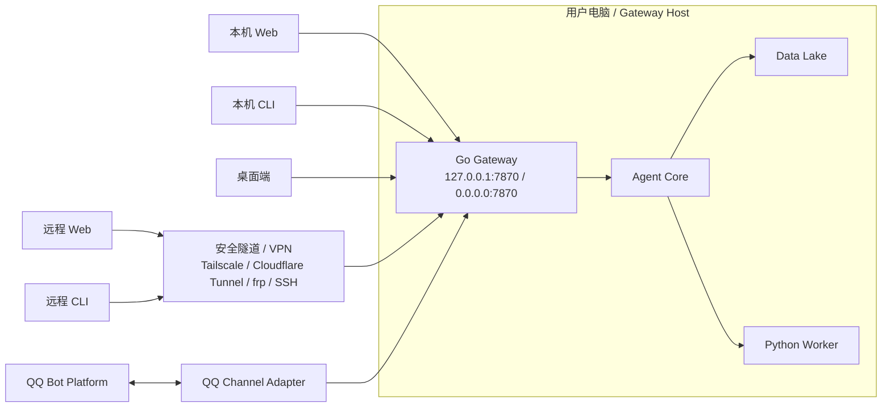

# 远程连接策略 SDD

版本：v0.1  
日期：2026-06-02  
适用范围：以当前 Windows 电脑作为本地 Gateway 主机，支持 Web、CLI、桌面端以及 QQ 等 Channel Adapter 远程连接。

## 1. 目标

当前系统需要同时支持：

- 本机 Web：浏览器打开 `http://127.0.0.1:7870/`。
- 本机 CLI：`labelctl --addr http://127.0.0.1:7870 ...`。
- 桌面端：本机或远程连接同一个 Gateway。
- QQ Channel：QQ 平台消息进入本机 Agent Gateway。
- 后续 Telegram、飞书等 Channel：复用同一套连接与鉴权策略。

核心原则：

```text
所有入口只连接 Gateway。
任何入口都不能直接访问 Data Lake、模型目录、Python worker、训练脚本或部署脚本。
```

## 2. 总体拓扑



## 3. 连接模式

### 3.1 本机模式

用于当前开发和单机运行。

```text
Gateway listen: 127.0.0.1:7870
Web:           http://127.0.0.1:7870/
CLI:           labelctl --addr http://127.0.0.1:7870
Desktop:       http://127.0.0.1:7870
```

策略：

- 默认只监听 `127.0.0.1`。
- 可以允许开发态无登录，但仍然要保留本地 audit。
- destructive action 仍然走审批，不因为本机访问而绕过。

### 3.2 局域网模式

用于同一内网机器访问你的电脑。

```text
Gateway listen: 0.0.0.0:7870
Access:        http://<你的电脑局域网 IP>:7870
```

策略：

- 必须启用 token auth。
- Windows 防火墙只允许可信网段或指定机器访问。
- Web 需要限制 allowed origins。
- CLI / Desktop 必须带 `Authorization: Bearer <token>`。
- 不允许 Data Lake 文件目录通过 SMB 或静态目录直接暴露。

### 3.3 远程公网模式

不建议把 `7870` 直接暴露到公网。推荐远程访问路径：

```text
Remote Client
  -> HTTPS Tunnel / VPN
  -> Gateway 127.0.0.1:7870
```

可选方案：

| 方案 | 适用场景 | 说明 |
| --- | --- | --- |
| Tailscale | 个人多设备、实验室机器 | 推荐优先使用，减少公网暴露。 |
| Cloudflare Tunnel | 需要 HTTPS 域名和 Web 访问 | 适合 Web/CLI/桌面统一远程入口。 |
| frp | 有自有服务器 | 适合内网穿透，但需要自己维护 TLS 和访问控制。 |
| SSH Reverse Tunnel | 临时调试 | 适合短时 CLI 访问。 |

远程公网模式必须满足：

- HTTPS。
- Gateway token。
- 最小 API 暴露。
- 访问日志和审计。
- rate limit。
- 高风险动作审批。

### 3.4 Channel 模式

QQ、Telegram、飞书等 Channel 不是普通用户客户端，而是平台入口。它们通过 Channel Adapter 连接 Gateway。

优先策略：

```text
Channel Adapter 在你的电脑上运行。
Adapter 主动连接平台 WebSocket / long polling。当前 QQ/NapCat MVP 已提供可选 OneBot WebSocket reader：`QQ_ONEBOT_WS_ENABLED=true` 时 Gateway 主动连接 `QQ_ONEBOT_WS_URL`。
Adapter 再把归一化消息交给本机 Gateway。
```

只有平台强制 webhook 时才暴露公网 webhook：

```text
Platform Webhook
  -> HTTPS Tunnel
  -> /api/channels/<channel>/webhook
  -> signature verification
  -> Channel Adapter
  -> Gateway
```

Webhook 暴露时只允许 channel webhook 路径，不暴露完整后台管理 API。

## 4. 客户端连接策略

### 4.1 Web 端

Web 端运行在 Gateway 静态服务下，或者远程 HTTPS 域名下。

连接要求：

- 同源访问时直接请求 `/api`。
- 跨域访问时必须配置 allowed origins。
- 登录态使用短期 access token。
- 管理操作必须带 CSRF / origin 校验。
- Web 不保存 AppSecret、模型密钥、QQ secret。

### 4.2 CLI

CLI 使用显式 Gateway 地址：

```powershell
labelctl --addr http://127.0.0.1:7870 health
labelctl --addr https://atm.example.com health
```

建议配置 profile：

```text
~/.automated-training-model/profiles.json
  local:
    url: http://127.0.0.1:7870
  remote:
    url: https://atm.example.com
    token_ref: atm/remote/operator
```

CLI 权限策略：

- 本机 profile 可以操作更多开发命令。
- remote profile 默认 operator 权限。
- destructive action 必须二次确认或进入审批。
- `--auto` 只允许执行低风险动作和 dry-run。

### 4.3 桌面端

桌面端是 Agent Client，不是新的后端。

连接策略：

- 支持多个 Gateway profile：local、lan、remote。
- 首次连接通过 pairing code 或 token 导入。
- 本机模式可自动发现 `127.0.0.1:7870`。
- 局域网可后续做 mDNS / 手动 IP。
- 远程模式只允许 HTTPS。
- 桌面端只保存 token ref，不保存平台 secret。

桌面端 profile 草案：

```json
{
  "profiles": [
    {
      "id": "local",
      "name": "本机",
      "base_url": "http://127.0.0.1:7870",
      "trust": "loopback"
    },
    {
      "id": "remote-lab",
      "name": "实验室电脑",
      "base_url": "https://atm.example.com",
      "trust": "remote",
      "token_ref": "desktop/remote-lab"
    }
  ]
}
```

### 4.4 QQ Channel

QQ Adapter 与 Gateway 的关系：

```text
QQ Platform <-> QQ Adapter -> Gateway
```

QQ Adapter 可以和 Gateway 同进程，也可以后续拆成 sidecar。MVP 推荐同进程，减少部署复杂度。

连接策略：

- QQ account secret 使用 SecretRef。
- Adapter 启动后主动连接 QQ WebSocket gateway。
- 每条入站消息都归一成 `InboundMessage`。
- 每条出站回复都通过 `ReplyRouter` 回到原 peer。
- QQ 不能直接调用 workflow service，必须走 `AgentIngress`。

## 5. 鉴权与权限

统一身份类型：

| 身份 | 来源 | 权限 |
| --- | --- | --- |
| local-dev | 127.0.0.1 | 开发调试，仍受审批约束。 |
| cli-operator | CLI token | 数据集、任务、run、dry-run、查询。 |
| desktop-operator | 桌面端 token | 任务、审批、日志、模型注册。 |
| web-user | Web session | 按角色控制页面与操作。 |
| qq-sender | QQ openid | 受 allowlist 和 group policy 控制。 |
| channel-account | QQ Bot account | 只允许收发消息和提交 AgentIngress。 |

统一权限等级：

```text
viewer      只读
operator    可提交 dry-run、查看日志、触发低风险任务
reviewer    可做数据审核和标注确认
approver    可审批高风险动作
admin       可配置 channel、secret、policy
```

高风险动作：

- 删除源数据。
- 导出敏感数据。
- 训练正式任务。
- 注册生产模型。
- 发布模型。
- 部署或回滚线上服务。
- 修改 channel secret / allowlist / policy。

这些动作必须走 Approval，不允许 QQ 或 remote CLI 直接执行。

## 6. 配置设计

建议新增统一连接配置：

```text
configs/gateway.yaml
configs/channels.qq.yaml
```

Gateway 配置草案：

```yaml
gateway:
  listen: "127.0.0.1:7870"
  public_base_url: ""
  auth:
    loopback_trust: true
    require_token_on_non_loopback: true
    token_store: "data_lake/secrets/tokens.json"
  cors:
    allowed_origins:
      - "http://127.0.0.1:7870"
      - "http://localhost:7870"
  remote:
    require_https: true
    trusted_proxy_headers: false
  rate_limit:
    enabled: true
    per_minute: 120
```

QQ 配置草案：

```yaml
channels:
  qq:
    enabled: false
    accounts:
      default:
        enabled: false
        app_id: "${QQBOT_APP_ID}"
        secret_ref: "env:QQBOT_CLIENT_SECRET"
        default_agent_id: "main"
        allow_from: []
        group_policy: "allowlist"
        group_allow_from: []
        groups:
          "*":
            require_mention: true
            history_limit: 20
            tool_policy: "restricted"
```

## 7. API 边界

远程连接只允许通过 Gateway API：

```text
GET  /healthz
GET  /api/session
GET  /api/agents
GET  /api/workflows
POST /api/agent-runs
GET  /api/agent-runs
GET  /api/audit-events
GET  /api/channels
GET  /api/channels/qq/status
POST /api/channels/qq/webhook
```

禁止远程直接暴露：

```text
data_lake/*
workers/*
ops/scripts/*
模型权重目录
annotation root 文件系统写入口
```

## 8. SDD 测试计划

### 8.1 连接测试

| ID | 场景 | 验收标准 |
| --- | --- | --- |
| CONN-001 | 本机 Web 访问 `127.0.0.1:7870` | 页面加载，`/healthz` 返回 OK。 |
| CONN-002 | 本机 CLI 指向 `127.0.0.1:7870` | `labelctl health` 成功。 |
| CONN-003 | 非 loopback 未带 token 访问 API | 返回 401。 |
| CONN-004 | CLI remote profile 带 token 访问 HTTPS Gateway | `health` 和只读 API 成功。 |
| CONN-005 | 远程 HTTP 明文访问 remote profile | 拒绝或重定向到 HTTPS。 |
| CONN-006 | 桌面端导入 remote profile | 能读取状态，不能读取本地文件路径。 |

### 8.2 权限测试

| ID | 场景 | 验收标准 |
| --- | --- | --- |
| AUTH-001 | viewer token 提交 agent run | 403。 |
| AUTH-002 | operator token 提交 dry-run | 202，run 参数包含 `dry_run=true`。 |
| AUTH-003 | operator token 提交发布/部署 | 进入 approval，不直接执行。 |
| AUTH-004 | QQ 未 allowlist sender 发消息 | 不进入 Agent run，写入 denied audit。 |
| AUTH-005 | QQ admin 命令使用 wildcard allowlist | 拒绝 admin 权限。 |

### 8.3 Channel 测试

| ID | 场景 | 验收标准 |
| --- | --- | --- |
| CH-QQ-001 | `/bot-ping` | 返回 pong，不调用 Agent。 |
| CH-QQ-002 | `/bot-me` | 返回 sender openid，用于配置 allowlist。 |
| CH-QQ-003 | 群聊未 @Bot | 不回复，不创建新 run。 |
| CH-QQ-004 | 群聊 @Bot 查询状态 | 通过 allowlist 后返回状态。 |
| CH-QQ-005 | `/bot-run dry` | 创建 `source=qq` 的 dry-run。 |
| CH-QQ-006 | QQ 触发 destructive action | 进入 approval 或拒绝。 |
| CH-QQ-007 | Bot 自己消息回显 | 被忽略，防止 echo loop。 |
| CH-QQ-008 | QQ 上传图片或 zip | 生成 AttachmentRef 和 Data Intake Plan，不直接写 Data Lake。 |
| CH-QQ-009 | QQ 上传 manifest | Agent 生成 dataset register dry-run plan。 |

### 8.4 审计测试

| ID | 场景 | 验收标准 |
| --- | --- | --- |
| AUDIT-001 | CLI remote 调用 run | audit 包含 actor、source、remote profile、request id。 |
| AUDIT-002 | Web 审批动作 | audit 包含 user、approval id、decision。 |
| AUDIT-003 | QQ 入站消息 | audit 包含 channel、account、peer、sender、decision。 |
| AUDIT-004 | 被拒绝的访问 | audit 记录 denied reason。 |

### 8.5 隔离测试

| ID | 场景 | 验收标准 |
| --- | --- | --- |
| ISO-001 | 远程客户端请求 Data Lake 文件路径 | 不返回本机绝对路径或文件内容。 |
| ISO-002 | QQ 消息携带文件路径 | 不直接读取，必须经过 media policy。 |
| ISO-003 | 多 channel account | token、queue、status、audit 隔离。 |
| ISO-004 | Gateway 重启 | channel 状态可恢复，未完成 run 不丢失。 |

## 9. 实施顺序

1. 增加 Gateway auth 配置和 token middleware。
2. 增加 CLI profile 和 `--token` / token ref 支持。
3. 增加 `internal/domain/channel`、`internal/app/channelapp`。
4. 增加 QQ Adapter MVP。
5. 增加 Web Channels / Remote Profile 页面。
6. 增加桌面端连接 profile 设计和 TUI/desktop MVP。
7. 按本 SDD 的连接、权限、channel、审计、隔离测试补自动化测试。
